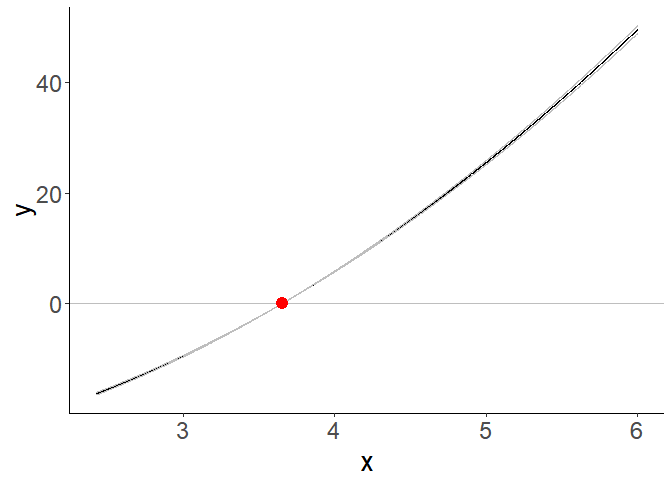
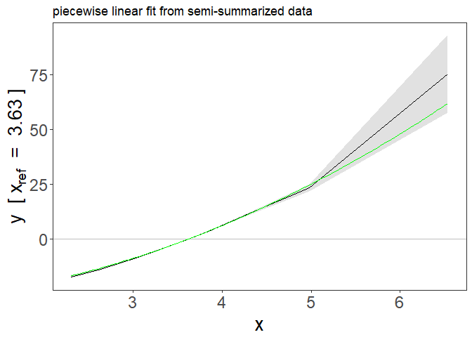
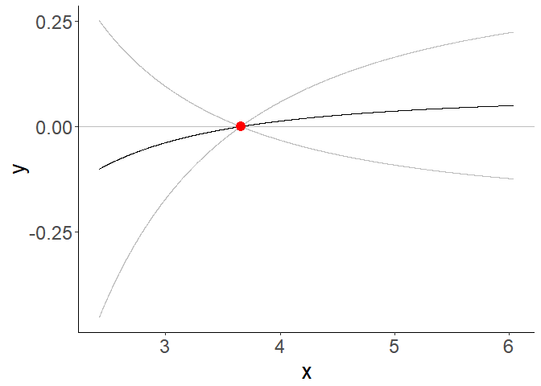
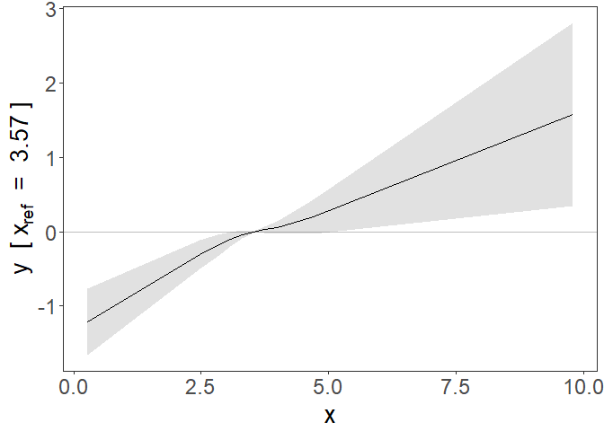
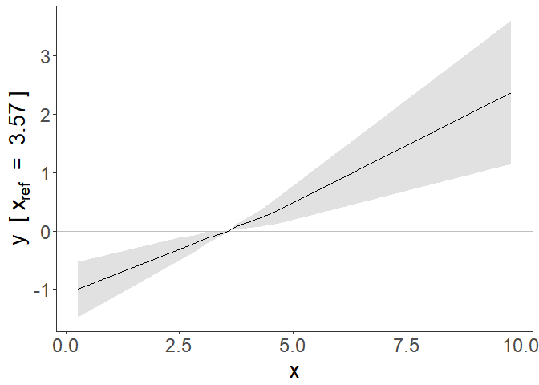

<!-- README.md is generated from README.Rmd. Please edit that file -->

# SUMnlmr

<!-- badges: start -->

<!-- badges: end -->

The goal of SUMnlmr is to allow investigations of potentially non-linear
relationships between an exposure and an outcome via a Mendelian
randomization framework, without requiring full access to individual
level genetic data.

It is based on the existing package for individual data by James Staley:
nlmr (available from <https://github.com/jrs95/nlmr> ).

The core concept is to split the process into two distinct halfs: one
requiring individual level data, which is converted into a
semi-summarized form (create\_nlmr\_summary) by dividing the population
into strata based on the IV-free exposure. Associations with the
exposure and the outcome are estimated in each stratum. In the second
half, this semi-summarized form can then be shared, without compromising
patient privacy, and investigated seperately using two IV methods: a
fractional polynomial method (frac\_poly\_summ\_mr) and a piecewise
linear method (piecewise\_summ\_mr). Both methods calculate a localised
causal effect (LACE). The piecewise method fits a continuous piecewise
linear function to these estimates, while the fractional polynomial
method fits the best 1 or 2 term fractional polynomial.

## Functions

*create\_nlmr\_summary* - prepares individual level data into
semi-summarised form, ready to fit nlmr models. *fracpoly\_summ\_mr* -
this method performs IV analysis using fractional polynomials
*piecewise\_summ\_mr* - this method performs IV analysis using piecewise
linear function

## Installation

You can install the released version of SUMnlmr from
[GitHub](https://github.com/) with:

``` r
# install.packages("devtools")
devtools::install_github("amymariemason/SUMnlmr")
```

## Example 1: Summarizing data

This is a basic example which shows you how to create the
semi-summarized data form. First we create some practise data:

``` r
library(SUMnlmr)
## create some data to practise on
test_data<-create_ind_data(N=10000, beta2=2, beta1=1)
# this creates quadratic.Y  = x + 2x^2 + errorY 
head(test_data)
#>   g          u     errorX     errorY        X linear.Y quadratic.Y   sqrt.Y
#> 1 1 0.19257241 0.21750424  0.1095893 2.660077 2.923724    17.07574 1.894621
#> 2 1 0.99226645 0.89983127  1.2951760 4.142098 6.231087    40.54503 4.124204
#> 3 0 0.09505427 0.65239362  0.4421590 2.747448 3.265650    18.36259 2.175745
#> 4 0 0.78136090 0.29185969 -0.2402236 3.073221 3.458086    22.34746 2.137926
#> 5 1 0.80840200 0.02554516  0.2703329 3.083947 4.001002    23.02246 2.673172
#> 6 0 0.20685864 1.57363289  0.2451439 3.780492 4.191122    32.77535 2.354979
#>      log.Y threshold.Y fracpoly.Y
#> 1 1.242002    2.923724   4.880434
#> 2 3.510192    6.231087   9.073492
#> 3 1.528875    3.265650   5.286995
#> 4 1.507591    3.458086   5.703538
#> 5 2.043265    4.001002   6.253422
#> 6 1.740485    4.191122   6.850830
```

Then we use create\_nlmr\_summary to summarise it.

``` r

## create the summarized form
## 
summ_data<-create_nlmr_summary(y = test_data$quadratic.Y,
                                x = test_data$X,
                                g = test_data$g,
                                covar = NULL,
                                family = "gaussian",
                                q = 10)

head(summ_data)
#> $summary
#>           bx       by        bxse       byse   x0mean    xmean     xmin
#> 1  0.2563274 2.840523 0.005990312 0.08290871 2.469945 2.427134 2.016511
#> 2  0.2431256 3.121202 0.003048890 0.06632459 2.750736 2.739816 2.616297
#> 3  0.2363550 3.062920 0.002609102 0.05969029 2.965709 2.944732 2.855639
#> 4  0.2407049 3.253521 0.002190186 0.05788702 3.114415 3.119253 3.028854
#> 5  0.2361049 3.326372 0.002731445 0.06426864 3.291852 3.303813 3.212336
#> 6  0.2373013 3.635229 0.003264085 0.07012718 3.499586 3.509724 3.400367
#> 7  0.2372523 3.915659 0.004031938 0.08267972 3.763051 3.771174 3.628152
#> 8  0.2352524 4.174409 0.005428004 0.10836539 4.091994 4.106221 3.921516
#> 9  0.2331673 4.529809 0.009505515 0.19040207 4.599431 4.611692 4.303846
#> 10 0.2020572 4.775111 0.050378810 1.45151717 5.985223 5.998383 4.978541
#>         xmax
#> 1   2.616271
#> 2   2.855350
#> 3   3.028849
#> 4   3.211992
#> 5   3.400278
#> 6   3.627897
#> 7   3.921352
#> 8   4.303474
#> 9   4.976744
#> 10 12.042297
```

If we have co-variants we want to adjust for in our analysis, we need to
include them at this stage.

``` r

## create the summarized form
summ_covar<-create_nlmr_summary(y = test_data$quadratic.Y,
                                x = test_data$X,
                                g = test_data$g,
                                covar = matrix(data=c(test_data$linear.Y,
                                                      test_data$sqrt.Y),ncol=2),
                                family = "gaussian",
                                q = 10)

head(summ_covar)
#> $summary
#>             bx         by         bxse        byse   x0mean    xmean     xmin
#> 1  0.019229675 -1.9591380 2.073199e-03 0.312716839 3.570962 2.427134 2.016511
#> 2  0.010012377 -0.7502508 2.746962e-04 0.021081387 3.026816 2.739816 2.616297
#> 3  0.008692008 -0.6602348 1.766025e-04 0.013770247 3.174696 2.944732 2.855639
#> 4  0.009096207 -0.7113932 1.204047e-04 0.009856845 3.263246 3.119253 3.028854
#> 5  0.008895909 -0.7241509 1.062682e-04 0.009262104 3.490694 3.303813 3.212336
#> 6  0.009106506 -0.7680654 9.084954e-05 0.008139758 3.675445 3.509724 3.400367
#> 7  0.008896036 -0.7773520 7.908080e-05 0.007217543 3.910962 3.771174 3.628152
#> 8  0.008673889 -0.7633911 8.821448e-05 0.008091382 4.031938 4.106221 3.921516
#> 9  0.007818008 -0.7035055 1.122742e-04 0.010093100 4.149922 4.611692 4.303846
#> 10 0.003225216 -0.2915892 2.592554e-04 0.023413905 4.237261 5.998383 4.978541
#>         xmax
#> 1   2.616271
#> 2   2.855350
#> 3   3.028849
#> 4   3.211992
#> 5   3.400278
#> 6   3.627897
#> 7   3.921352
#> 8   4.303474
#> 9   4.976744
#> 10 12.042297
```

These have used a single genetic variant count, but the method works
identically with an genetic score function for g instead.

Once your data is in this format, the output data frame is all you need
to share to fit the fractional polynomial or piecewise linear models
onto the data.

## Example 2: Fitting a fractional polynomial model

Your data needs to be in the semi-summarised form as shown above. We can
then fit a fractional polynomial model:

``` r


model<- with(summ_data$summary, frac_poly_summ_mr(bx=bx,
                  by=by, 
                  bxse=bxse, 
                  byse=byse, 
                  xmean=xmean,
                  family="gaussian",
                  fig=TRUE)
)


summary(model)
#> Call: frac_poly_mr
#> 
#> Number of individuals: NA; Quantiles: 10; 95%CI: Model based SEs
#> 
#> Powers: 2
#> 
#> Coefficients:
#>   Estimate Std. Error 95%CI Lower 95%CI Upper   p.value    
#> 2 2.189596   0.015964    2.158307      2.2209 < 2.2e-16 ***
#> ---
#> Signif. codes:  0 '***' 0.001 '**' 0.01 '*' 0.05 '.' 0.1 ' ' 1
#> 
#> Non-linearity tests
#> Fractional polynomial degree p-value: 1.11e-06
#> Fractional polynomial non-linearity p-value: 0
#> Quadratic p-value: 2.95e-50
#> Cochran Q p-value: 0
#> 
#> Heterogeneity tests
#> Cochran Q p-value: 0.0965
#> Trend p-value: 0.0134
```

 This also
produces a graph of the fit with 95% confidence intervals. This is a
ggplot object and can be adjusted with ggplot commands

``` r
library(ggplot2)
f <- function(x) (x + 2*x^2 - mean(summ_data$summary$xmean) -
                    2*mean(summ_data$summary$xmean)^2 )

plot1 <- model$figure+ 
  stat_function(fun = f, colour = "green") +
  ggtitle("fractional polynomial fit from semi-summarized data")

plot1
```

 There is
also p-values provided in p\_test and p\_het. This is identical to the
testing provided by the nlmr package: \* fp\_d1\_d2 : test between the
fractional polynomial degrees \* fp : fractional polynomial
non-linearity test \* quad: quadratic test \* Q : Cochran Q test and \*
Q: Cochran Q heterogeneity test \* trend: trend test

``` r
model$p_tests
#>          fp_d1_d2 fp         quad Q
#> [1,] 1.105956e-06  0 2.950345e-50 0

model$p_heterogeneity
#>               Q      trend
#> [1,] 0.09648072 0.01337154
```

## Example 3: Piecewise linear model

We can instead fit a piecewise linear model to the same summarised data

``` r

model2 <-with(summ_data$summary, piecewise_summ_mr(by, bx, byse, bxse, x0mean, xmean, xmin,xmax, 
                  ci="bootstrap_se",
                  nboot=1000, 
                  fig=TRUE,
                  family="gaussian",
                  ci_fig="ribbon")
)

summary(model2)
#> Call: piecewise_mr
#> 
#> Number of individuals: ; Quantiles: 10; Number of bootstrap replications: 1000
#> 
#> LACE:
#>    Estimate Std. Error 95%CI Lower 95%CI Upper   p.value    
#> 1  11.88309    0.34684    11.19833      12.568 < 2.2e-16 ***
#> 2  13.05729    0.27746    12.49250      13.622 < 2.2e-16 ***
#> 3  12.81347    0.24971    12.31661      13.310 < 2.2e-16 ***
#> 4  13.61083    0.24217    13.12634      14.095 < 2.2e-16 ***
#> 5  13.91560    0.26886    13.35748      14.474 < 2.2e-16 ***
#> 6  15.20768    0.29337    14.60379      15.812 < 2.2e-16 ***
#> 7  16.38083    0.34588    15.66367      17.098 < 2.2e-16 ***
#> 8  17.46329    0.45334    16.59874      18.328 < 2.2e-16 ***
#> 9  18.95008    0.79653    17.40968      20.491 < 2.2e-16 ***
#> 10 19.97628    6.07230     8.32008      31.633 0.0007822 ***
#> ---
#> Signif. codes:  0 '***' 0.001 '**' 0.01 '*' 0.05 '.' 0.1 ' ' 1
#> 
#> Non-linearity tests
#> Quadratic p-value: 2.25e-50
#> Cochran Q p-value: 0
#> 
#> Heterogeneity tests
#> Cochran Q p-value: 0.0965
#> Trend p-value: 0.0154
```

 Again the
figure is a ggplot object and can be adjusted similarly.

``` r
plot2 <- model2$figure+ 
  stat_function(fun = f, colour = "green") +
  ggtitle("piecewise linear fit from semi-summarized data")

plot2
```



## Example 4: Binary outcome

The functions above can also fit binary outcome data, via a generalised
linear model.

``` r

test_data$y.bin<-stats::rbinom(size=1, p=0.5, n=10000)

# create semo-summ data
summ_bin<-create_nlmr_summary(y = test_data$y.bin,
                                x = test_data$X,
                                g = test_data$g,
                                covar = NULL,
                                family = "binomial",
                                q = 10)

# fit fractional poly model


model3<- with(summ_bin$summary,frac_poly_summ_mr(bx=bx,
                  by=by, 
                  bxse=bxse, 
                  byse=byse, 
                  xmean=xmean,
                  family="gaussian",
                  fig=TRUE)
)

summary(model3)
#> Call: frac_poly_mr
#> 
#> Number of individuals: NA; Quantiles: 10; 95%CI: Model based SEs
#> 
#> Powers: -2
#> 
#> Coefficients:
#>    Estimate Std. Error 95%CI Lower 95%CI Upper p.value  
#> -2  3.32411    1.89864    -0.39723      7.0454 0.07998 .
#> ---
#> Signif. codes:  0 '***' 0.001 '**' 0.01 '*' 0.05 '.' 0.1 ' ' 1
#> 
#> Non-linearity tests
#> Fractional polynomial degree p-value: 0.214
#> Fractional polynomial non-linearity p-value: 0.14
#> Quadratic p-value: 0.851
#> Cochran Q p-value: 0.133
#> 
#> Heterogeneity tests
#> Cochran Q p-value: 0.212
#> Trend p-value: 0.0251
```

 Not
unsurprisingly, we find no evidence of an effect, causal or otherwise,
as the binary outcome was randomly distributed.

If we look instead at the semi-summarised UK Biobank datasets on
LDL-cholesterol and CAD, one with and one without covariates. Here we
can see a potentially non-linear trend in the univariate data, which
becomes a clear linear trend once covariates are included.

``` r

# fit piecewise linear model
model4 <-with(LDL_CAD, piecewise_summ_mr(by, bx, byse, bxse, x0mean, xmean, xmin,xmax, 
                  ci="bootstrap_se",
                  nboot=1000, 
                  fig=TRUE,
                  family="gaussian",
                  ci_fig="ribbon")
)


summary(model4)
#> Call: piecewise_mr
#> 
#> Number of individuals: ; Quantiles: 10; Number of bootstrap replications: 1000
#> 
#> LACE:
#>     Estimate Std. Error 95%CI Lower 95%CI Upper   p.value    
#> 1   0.406261   0.059553    0.294549      0.5180 1.019e-12 ***
#> 2   0.362442   0.073477    0.218945      0.5059 7.402e-07 ***
#> 3   0.311077   0.087016    0.134861      0.4873 0.0005401 ***
#> 4   0.286820   0.096907    0.102517      0.4711 0.0022867 ** 
#> 5   0.152663   0.101981   -0.044997      0.3503 0.1300742    
#> 6   0.141322   0.105426   -0.069907      0.3526 0.1897467    
#> 7   0.128421   0.102452   -0.077531      0.3344 0.2216494    
#> 8   0.191138   0.104945   -0.024860      0.4071 0.0828443 .  
#> 9   0.223650   0.104324    0.015376      0.4319 0.0353175 *  
#> 10  0.268987   0.098653    0.074594      0.4634 0.0066858 ** 
#> ---
#> Signif. codes:  0 '***' 0.001 '**' 0.01 '*' 0.05 '.' 0.1 ' ' 1
#> 
#> Non-linearity tests
#> Quadratic p-value: 0.0134
#> Cochran Q p-value: 0.193
#> 
#> Heterogeneity tests
#> Cochran Q p-value: 0
#> Trend p-value: 4.47e-19
```



``` r


# fit piecewise linear model
model5 <-with(LDL_CAD_covar,piecewise_summ_mr(by, bx, byse, bxse, x0mean, xmean, xmin,xmax, 
                  ci="bootstrap_se",
                  nboot=1000, 
                  fig=TRUE,
                  family="gaussian",
                  ci_fig="ribbon")
)

summary(model5)
#> Call: piecewise_mr
#> 
#> Number of individuals: ; Quantiles: 10; Number of bootstrap replications: 1000
#> 
#> LACE:
#>    Estimate Std. Error 95%CI Lower 95%CI Upper   p.value    
#> 1  0.307638   0.062863    0.184835      0.4304 9.105e-07 ***
#> 2  0.292289   0.078040    0.132482      0.4521 0.0003372 ***
#> 3  0.357924   0.091549    0.175390      0.5405 0.0001214 ***
#> 4  0.215240   0.101458    0.015487      0.4150 0.0346896 *  
#> 5  0.254128   0.106258    0.045407      0.4628 0.0170144 *  
#> 6  0.430854   0.107940    0.228680      0.6330 2.954e-05 ***
#> 7  0.258499   0.106875    0.054185      0.4628 0.0131457 *  
#> 8  0.292122   0.107517    0.087807      0.4964 0.0050735 ** 
#> 9  0.329697   0.106231    0.118516      0.5409 0.0022136 ** 
#> 10 0.395047   0.100530    0.199407      0.5907 7.566e-05 ***
#> ---
#> Signif. codes:  0 '***' 0.001 '**' 0.01 '*' 0.05 '.' 0.1 ' ' 1
#> 
#> Non-linearity tests
#> Quadratic p-value: 0.555
#> Cochran Q p-value: 0.928
#> 
#> Heterogeneity tests
#> Cochran Q p-value: 0
#> Trend p-value: 7.45e-19
```


