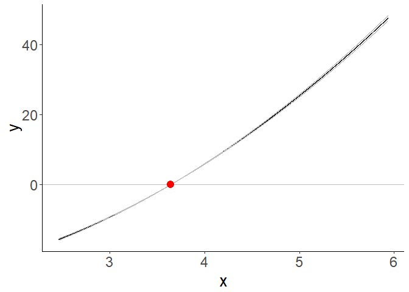
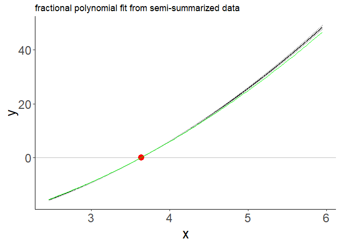
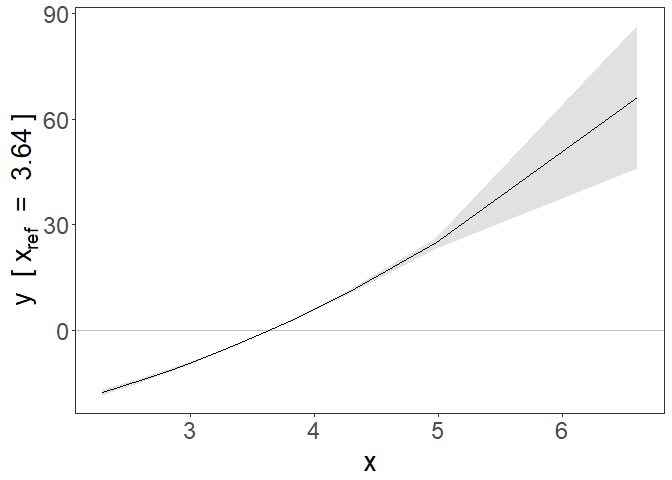
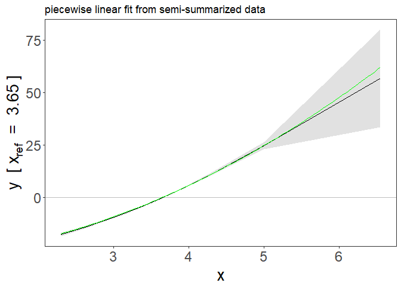
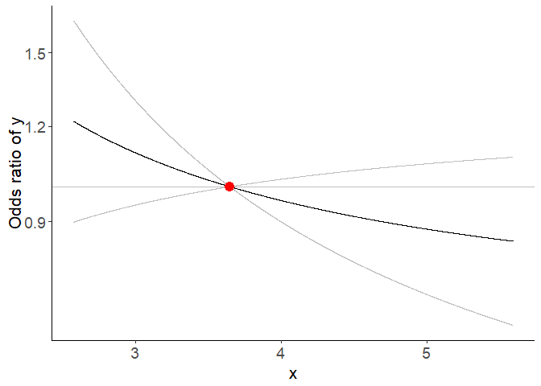
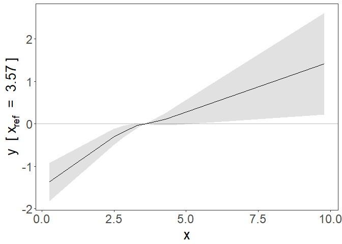
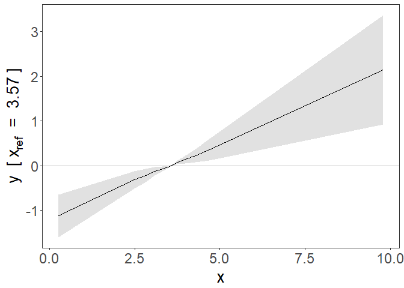

<!-- README.md is generated from README.Rmd. Please edit that file -->

# SUMnlmr

<!-- badges: start -->

<!-- badges: end -->

The goal of SUMnlmr is to allow investigations of potentially non-linear
relationships between an exposure and an outcome via a Mendelian
randomization framework, without requiring full access to individual
level genetic data.

It is based on the existing package for individual data by James Staley:
nlmr (available from <https://github.com/jrs95/nlmr> ).

The core concept is to split the process into two distinct halves: one
requiring individual level data, which is converted into a
semi-summarized form (create_nlmr_summary) by dividing the population
into strata based on the IV-free exposure. Associations with the
exposure and the outcome are estimated in each stratum. In the second
half, this semi-summarized form can then be shared, without compromising
patient privacy, and investigated separately using two IV methods: a
fractional polynomial method (frac_poly_summ_mr) and a piecewise linear
method (piecewise_summ_mr). Both methods calculate a localised causal
effect (LACE). The piecewise method fits a continuous piecewise linear
function to these estimates, while the fractional polynomial method fits
the best 1 or 2 term fractional polynomial.

## Functions

- *create_nlmr_summary* — prepares individual level data into
  semi-summarised form, ready to fit nlmr models. Supports three
  stratification methods:
  - `"residual"` — the original IV-free residual approach (Staley &
    Burgess, 2017)
  - `"ranked"` — the doubly-ranked method (Tian et al., 2022)
  - `"interaction"` — an extension of the ranked method that corrects
    for GxE-induced bias by removing the interaction component from the
    exposure before stratification (Zhou et al., 2026)
- *frac_poly_summ_mr* — performs IV analysis using fractional
  polynomials.
- *piecewise_summ_mr* — performs IV analysis using a piecewise linear
  function.

## Installation

You can install the released version of SUMnlmr from
[GitHub](https://github.com/) with:

``` r
# install.packages("devtools")
devtools::install_github("amymariemason/SUMnlmr")
```

## Example 1: Summarizing data

This is a basic example which shows you how to create the
semi-summarized data form. First we create some practice data:

``` r
devtools::load_all()
#> ℹ Loading SUMnlmr
#library(SUMnlmr)
## create some data to practise on
test_data<-create_ind_data(N=10000, beta2=2, beta1=1)
# this creates quadratic.Y  = x + 2x^2 + errorY 
head(test_data)
#>   g           u    errorX      errorY        X linear.Y quadratic.Y   sqrt.Y
#> 1 0 0.802975431 0.9579160  0.42883666 3.760891 4.832108    33.12072 3.010519
#> 2 1 0.300695505 0.7700275 -0.79360776 3.320723 2.767672    24.82207 1.269234
#> 3 0 0.942667757 1.6159523 -0.18407405 4.558620 5.128680    46.69071 2.705153
#> 4 1 0.258957808 1.1221920 -0.33885723 3.631150 3.499459    29.86996 1.773867
#> 5 0 0.329939421 0.7021331  0.06028663 3.032073 3.356311    21.74324 2.065523
#> 6 1 0.007098159 0.2115599 -0.30224932 2.468658 2.172087    14.36063 1.274626
#>       log.Y threshold.Y fracpoly.Y
#> 1 2.3958730    4.832108   7.481421
#> 2 0.6471312    2.767672   5.168037
#> 3 2.0870801    5.128680   8.162720
#> 4 1.1578584    3.499459   6.078558
#> 5 1.4334846    3.356311   5.574803
#> 6 0.6071039    2.172087   3.979437
```

Then we use create_nlmr_summary to summarise it.

``` r

## create the summarized form
## 
summ_data<-create_nlmr_summary(y = test_data$quadratic.Y,
                                x = test_data$X,
                                g = test_data$g,
                                covar = NULL,
                                family = "gaussian",
                                strata_method = "residual", 
                                controlsonly = FALSE,
                                q = 10)

head(summ_data$summary)
#>          bx       by        bxse       byse    xmean     xmin     xmax
#> 1 0.2514030 2.779295 0.005842237 0.08256328 2.458526 2.292075 2.710064
#> 2 0.2387185 2.851723 0.003022464 0.06280557 2.754087 2.539313 2.986062
#> 3 0.2476249 3.151911 0.002801175 0.06228915 2.952464 2.739957 3.136492
#> 4 0.2417463 3.304672 0.002187074 0.05758683 3.126968 2.932898 3.384688
#> 5 0.2445436 3.625258 0.002462056 0.05953798 3.286819 3.090312 3.470265
#> 6 0.2361745 3.601040 0.003103201 0.06638415 3.483181 3.277492 3.687405
```

Note 1: This example uses the residual method, which relies on
parametric assumptions of linearity and homogeneity in the
instrument-exposure model. We do not believe these conditions are met in
practice and do not recommend applying this method. We include it here
for completeness.

If we have covariates we want to adjust for in our analysis, we need to
include them at this stage.

``` r
set.seed(9941)
## create the summarized form
summ_covar<-create_nlmr_summary(y = test_data$quadratic.Y,
                                x = test_data$X,
                                g = test_data$g,
                                covar = matrix(data=c(test_data$linear.Y,                                     test_data$sqrt.Y),ncol=2),
                                family = "gaussian",
                                strata_method = "residual", 
                                q = 10)
  
head(summ_covar$summary)
#>            bx         by         bxse        byse    xmean     xmin     xmax
#> 1 0.018331433 -1.7791212 2.257906e-03 0.370393684 3.497207 2.292075 7.310528
#> 2 0.008517503 -0.6219498 2.704356e-04 0.019751144 2.969934 2.558453 2.912190
#> 3 0.008984610 -0.6889187 1.750636e-04 0.014140987 3.214836 2.751615 5.649552
#> 4 0.008766865 -0.6884917 1.233303e-04 0.010128115 3.302528 2.918187 3.436474
#> 5 0.008686247 -0.7010795 9.481712e-05 0.008222132 3.453227 3.045727 4.858015
#> 6 0.008508117 -0.7155731 8.369881e-05 0.007459338 3.712752 3.172862 5.222230
```

Note 2: Because the covariates are included as a matrix, lm cannot
detect factor variables and create automatic dummy variables for them.
The easiest way to include factor variables is to make these dummy
variables by hand instead using the
[model.matrix](https://stat.ethz.ch/R-manual/R-devel/library/stats/html/model.matrix.html)
command. e.g.

``` r
set.seed(7778)
## create a factor
test_data$centre<- as.factor(rbinom(nrow(test_data),4, 0.5))

#turn factor into binary contrasts against first factor
dummies<- model.matrix(~centre,data=test_data)[,2:5]

summ_covar2<-create_nlmr_summary(y = test_data$quadratic.Y,
                                 x = test_data$X,
                                 g = test_data$g,
                                 covar = dummies,
                                 family = "gaussian",
                                 q = 10)

head(summ_covar2$summary)
#>          bx       by       bxse      byse    xmean     xmin     xmax
#> 1 0.2540068 2.860251 0.01056193 0.1353599 2.558141 2.318313 2.920534
#> 2 0.2431432 2.933477 0.01076003 0.1448294 2.787350 2.446266 3.154044
#> 3 0.2391517 3.160004 0.01112038 0.1536972 2.978264 2.630590 3.340381
#> 4 0.2418358 3.403488 0.01224383 0.1749038 3.147037 2.776917 3.519838
#> 5 0.2480532 3.630880 0.01401562 0.2130229 3.322328 2.926313 3.748002
#> 6 0.2462628 3.768265 0.01594885 0.2550745 3.520329 3.073060 4.001755
```

These have used a single genetic variant count, but the method works
identically with a genetic score function for g instead.

Logistic or Cox models in the G-Y relationship can be used by changing
the family option - see details in the create_nlmr_summary function
description.

### Relaxing the parametric assumption: the `"ranked"` method

It is also possible to implement the doubly-ranked method described in
[Tian et al.,
2022](https://www.biorxiv.org/content/10.1101/2022.06.28.497930v1). This
replaces the parametric assumptions with a rank-preserving assumption.
This is currently the default method of the package, but there are
concerns about this method’s application, particularly in UK Biobank,
with thanks to Hamilton et al., 2023
(<https://doi.org/10.1007/s10654-024-01113-9>) for their examples of
this. In particular, this method performs poorly when there is a GxE
interaction, as explained in Zhao et al., 2026
(<https://doi.org/10.64898/2026.01.22.26344640>).

To illustrate, we simulate a population with two unobserved subgroups: a
low-exposure group where the instrument is weak (`bx` ≈ 0.1) and a
high-exposure group where the instrument is strong (`bx` ≈ 0.8):

``` r

set.seed(5172)
N <- 10000

subgroup <- rbinom(N, 1, 0.5)   # unobserved; 50/50 split
rk_g     <- rbinom(N, 2, 0.3)
rk_u     <- rnorm(N)

rk_X <- ifelse(subgroup == 0,
  1 + 0.1 * rk_g + 0.3 * rk_u + abs(rnorm(N, 0, 0.5)),   # low-exposure group
  6 + 0.8 * rk_g + 0.3 * rk_u + abs(rnorm(N, 0, 0.5)))   # high-exposure group
rk_Y <- rk_X + 2 * rk_X^2 + 0.8 * rk_u + rnorm(N)

# Residual method — fits one linear g coefficient for the whole population
summ_rk_resid <- create_nlmr_summary(
  y = rk_Y, x = rk_X, g = rk_g,
  family = "gaussian", strata_method = "residual", q = 10
)

# Ranked method — makes no assumption about the shape of the g-x relationship
summ_rk_ranked <- create_nlmr_summary(
  y = rk_Y, x = rk_X, g = rk_g,
  family = "gaussian", strata_method = "ranked", q = 10
)
```

The ranked method correctly shows low `bx` in the low-exposure strata
(where the instrument is weak) and high `bx` in the high-exposure
strata. The residual method, forced to use a single average coefficient,
produces distorted intermediate values throughout:

``` r

data.frame(
  stratum     = 1:10,
  bx_residual = round(summ_rk_resid$summary$bx, 2),
  bx_ranked   = round(summ_rk_ranked$summary$bx, 2)
)
#>    stratum bx_residual bx_ranked
#> 1        1        0.38      0.15
#> 2        2        0.49      0.14
#> 3        3        0.50      0.22
#> 4        4        0.49      0.38
#> 5        5        0.32      0.47
#> 6        6        0.58      0.67
#> 7        7        0.52      0.76
#> 8        8        0.52      0.74
#> 9        9        0.52      0.76
#> 10      10        0.57      0.79
```

### Correcting for GxE interactions: the `"interaction"` method

This is an extension of the ranked method developed specifically to
mitigate GxE-induced bias in that method, as detailed in Zhou et al.,
2026 (<https://doi.org/10.64898/2026.01.22.2634464>). Stratification
methods can be biased when a covariate modifies the effect of the
instrument on the exposure (a GxE interaction). The `"interaction"`
method tries to address this by estimating and removing the interaction
component from the exposure before stratification.

Two additional matrices are supplied alongside the usual `covar`
argument:

- `gxe_interaction` (**H**): the effect modifier(s) that interact with
  `g`
- `gxe_covar` (**F**, optional): additional covariates for the
  interaction model that appear as main effects only

The stratification model fitted internally is: **X = β₀ + β_g·g +
β_F·F + β_H·H + β\_{g×H}·(g×H)**

The corrected exposure **X − β\_{g×H}·(g×H)** is then used to form
strata via the ranked method. Within-stratum genetic associations are
estimated using `covar` as usual.

To illustrate the difference, we simulate data where `modifier` strongly
amplifies the effect of `g` on `X` (GxE coefficient = 1.5, compared to a
main g effect of 0.25):

``` r

set.seed(8341)
N <- 10000

gxe_g        <- rbinom(N, 2, 0.3)
gxe_modifier <- rnorm(N)
gxe_u        <- runif(N, 0, 1)

# X has a strong GxE: the effect of g on X scales with modifier
gxe_X <- 2 + gxe_g * (0.25 + 1.5 * gxe_modifier) + gxe_u + rexp(N, 1)
gxe_Y <- gxe_X + 2 * gxe_X^2 + 0.8 * gxe_u + rnorm(N)

# Ranked method — no correction for the GxE
summ_gxe_ranked <- create_nlmr_summary(
  y = gxe_Y, x = gxe_X, g = gxe_g,
  family        = "gaussian",
  strata_method = "ranked",
  q = 10
)

# Interaction method — corrects for g x modifier before stratifying
summ_gxe_interaction <- create_nlmr_summary(
  y               = gxe_Y,
  x               = gxe_X,
  g               = gxe_g,
  gxe_interaction = matrix(gxe_modifier, ncol = 1),
  family          = "gaussian",
  strata_method   = "interaction",
  q = 10
)
```

In the ranked method, `bx` sweeps dramatically across strata (even
turning negative in the lowest strata) because the strata are confounded
with the modifier. The interaction method recovers approximately
constant `bx` values close to the true main effect of 0.25:

``` r

data.frame(
  stratum     = 1:10,
  bx_ranked      = round(summ_gxe_ranked$summary$bx, 2),
  bx_interaction = round(summ_gxe_interaction$summary$bx, 2)
)
#>    stratum bx_ranked bx_interaction
#> 1        1     -1.55           0.11
#> 2        2     -0.90           0.29
#> 3        3     -0.44           0.19
#> 4        4     -0.05           0.17
#> 5        5      0.27           0.27
#> 6        6      0.51           0.25
#> 7        7      0.71           0.07
#> 8        8      0.91           0.39
#> 9        9      1.23           0.14
#> 10      10      1.63           0.42
```

Once your data is in this format, the output data frame is all you need
to share to fit the fractional polynomial or piecewise linear models
onto the data.

## Example 2: Fitting a fractional polynomial model

Your data needs to be in the semi-summarised form as shown above. We can
then fit a fractional polynomial model:

``` r


model<- with(summ_data$summary, frac_poly_summ_mr(bx=bx,
                  by=by, 
                  bxse=bxse, 
                  byse=byse, 
                  xmean=xmean,
                  family="gaussian",
                  fig=TRUE)
)


summary(model)
#> Call: frac_poly_mr
#> 
#> Number of individuals: NA; Quantiles: 10; 95%CI: Model based SEs
#> 
#> Powers: 2
#> 
#> Coefficients:
#>   Estimate Std. Error 95%CI Lower 95%CI Upper   p.value    
#> 2 2.187646   0.015263    2.157730      2.2176 < 2.2e-16 ***
#> ---
#> Signif. codes:  0 '***' 0.001 '**' 0.01 '*' 0.05 '.' 0.1 ' ' 1
#> 
#> Non-linearity tests
#> Fractional polynomial degree p-value: 0.745
#> Fractional polynomial non-linearity p-value: 0
#> Quadratic p-value: 2.17e-79
#> Cochran Q p-value: 0
```

 This
also produces a graph of the fit with 95% confidence intervals. This is
a ggplot object and can be adjusted with ggplot commands

``` r
library(ggplot2)
f <- function(x) (x + 2*x^2 - mean(summ_data$summary$xmean) -
                    2*mean(summ_data$summary$xmean)^2 )

plot1 <- model$figure+ 
  stat_function(fun = f, colour = "green") +
  ggtitle("fractional polynomial fit from semi-summarized data")

plot1
```


There are also p-values provided in p_test and p_het. This is identical
to the testing provided by the nlmr package. First, testing the
heterogeneity of the LACE estimates:

- `fp_d1_d2`: test between the fractional polynomial degrees
- `fp`: fractional polynomial non-linearity test
- `quad`: quadratic test
- `Q`: Cochran Q test

And also testing the heterogeneity of the genetic-exposure associations:

- `Q`: Cochran Q heterogeneity test
- `trend`: trend test

``` r
model$p_tests
#>       fp_d1_d2 fp         quad Q
#> [1,] 0.7448851  0 2.165767e-79 0

model$p_heterogeneity
#> NULL
```

## Example 3: Piecewise linear model

We can instead fit a piecewise linear model to the same summarised data

``` r

model2 <-with(summ_data$summary, piecewise_summ_mr(by, bx, byse, bxse, xmean, xmin,xmax, 
                  ci="bootstrap_se",
                  nboot=1000, 
                  fig=TRUE,
                  family="gaussian",
                  ci_fig="ribbon")
)

summary(model2)
#> Call: piecewise_summ_mr
#>  Quantiles: 10; Number of bootstrap
#>       replications: 1000
#> 
#> LACE:
#>    Estimate Std. Error 95%CI Lower 95%CI Upper   p.value    
#> 1  11.05514    0.34983    10.36948      11.741 < 2.2e-16 ***
#> 2  11.94597    0.26084    11.43471      12.457 < 2.2e-16 ***
#> 3  12.72857    0.26055    12.21790      13.239 < 2.2e-16 ***
#> 4  13.67000    0.24484    13.19012      14.150 < 2.2e-16 ***
#> 5  14.82458    0.25242    14.32984      15.319 < 2.2e-16 ***
#> 6  15.24737    0.27825    14.70200      15.793 < 2.2e-16 ***
#> 7  16.05937    0.32255    15.42717      16.692 < 2.2e-16 ***
#> 8  17.43236    0.45367    16.54317      18.322 < 2.2e-16 ***
#> 9  19.82682    0.78096    18.29613      21.358 < 2.2e-16 ***
#> 10 25.47739    5.87923    13.95409      37.001 1.468e-05 ***
#> ---
#> Signif. codes:  0 '***' 0.001 '**' 0.01 '*' 0.05 '.' 0.1 ' ' 1
#> 
#> Non-linearity tests
#> Quadratic p-value: 2.17e-79
#> Cochran Q p-value: 0
```


Again the figure is a ggplot object and can be adjusted similarly.

``` r
plot2 <- model2$figure+ 
  stat_function(fun = f, colour = "green") +
  ggtitle("piecewise linear fit from semi-summarized data")

plot2
```



## Example 4: Binary outcome

The functions above can also fit binary outcome data, via a generalised
linear model.

``` r

test_data$y.bin<-stats::rbinom(size=1, p=0.5, n=10000)

# create summ data
summ_bin<-create_nlmr_summary(y = test_data$y.bin,
                                x = test_data$X,
                                g = test_data$g,
                                covar = NULL,
                                family = "binomial",
                                q = 10)

# fit fractional poly model


model3<- with(summ_bin$summary,frac_poly_summ_mr(bx=bx,
                  by=by, 
                  bxse=bxse, 
                  byse=byse, 
                  xmean=xmean,
                  family="binomial",
                  fig=TRUE)
)

summary(model3)
#> Call: frac_poly_mr
#> 
#> Number of individuals: NA; Quantiles: 10; 95%CI: Model based SEs
#> 
#> Powers: 3
#> 
#> Coefficients:
#>     Estimate Std. Error 95%CI Lower 95%CI Upper p.value
#> 3 -0.0026913  0.0027798  -0.0081397      0.0028   0.333
#> 
#> Non-linearity tests
#> Fractional polynomial degree p-value: 0.936
#> Fractional polynomial non-linearity p-value: 0.576
#> Quadratic p-value: 0.635
#> Cochran Q p-value: 0.868
```

 Not
unsurprisingly, we find no evidence of an effect, causal or otherwise,
as the binary outcome was randomly distributed.

Looking instead at the semi-summarised UK Biobank datasets on
LDL-cholesterol and CAD — one with and one without covariates — we can
see a potentially non-linear trend in the univariate data, which becomes
a clear linear trend once covariates are included.

``` r

# fit piecewise linear model
model4 <-with(LDL_CAD, piecewise_summ_mr(by, bx, byse, bxse, xmean, xmin,xmax, 
                  ci="bootstrap_se",
                  nboot=1000, 
                  fig=TRUE,
                  family="gaussian",
                  ci_fig="ribbon")
)


summary(model4)
#> Call: piecewise_summ_mr
#>  Quantiles: 10; Number of bootstrap
#>       replications: 1000
#> 
#> LACE:
#>     Estimate Std. Error 95%CI Lower 95%CI Upper   p.value    
#> 1   0.476044   0.060400    0.357660      0.5944 3.235e-15 ***
#> 2   0.364945   0.073259    0.221357      0.5085 6.307e-07 ***
#> 3   0.312283   0.086240    0.143253      0.4813 0.0002933 ***
#> 4   0.287650   0.095604    0.100267      0.4750 0.0026230 ** 
#> 5   0.152506   0.101609   -0.046648      0.3517 0.1333784    
#> 6   0.141101   0.104180   -0.063092      0.3453 0.1756110    
#> 7   0.127970   0.102638   -0.073201      0.3291 0.2124684    
#> 8   0.189778   0.103037   -0.012174      0.3917 0.0654969 .  
#> 9   0.221003   0.105940    0.013359      0.4286 0.0369692 *  
#> 10  0.237997   0.096643    0.048577      0.4274 0.0137914 *  
#> ---
#> Signif. codes:  0 '***' 0.001 '**' 0.01 '*' 0.05 '.' 0.1 ' ' 1
#> 
#> Non-linearity tests
#> Quadratic p-value: 0.00317
#> Cochran Q p-value: 0.0631
```



``` r


# fit piecewise linear model
model5 <-with(LDL_CAD_covar,piecewise_summ_mr(by, bx, byse, bxse, xmean, xmin,xmax, 
                  ci="bootstrap_se",
                  nboot=1000, 
                  fig=TRUE,
                  family="gaussian",
                  ci_fig="ribbon")
)

summary(model5)
#> Call: piecewise_summ_mr
#>  Quantiles: 10; Number of bootstrap
#>       replications: 1000
#> 
#> LACE:
#>    Estimate Std. Error 95%CI Lower 95%CI Upper   p.value    
#> 1  0.362034   0.063756    0.237073      0.4870 1.359e-08 ***
#> 2  0.295715   0.077811    0.143206      0.4482 0.0001444 ***
#> 3  0.359511   0.090733    0.181675      0.5373 7.423e-05 ***
#> 4  0.215239   0.100090    0.019063      0.4114 0.0315186 *  
#> 5  0.253899   0.105870    0.046393      0.4614 0.0164756 *  
#> 6  0.429836   0.106667    0.220769      0.6389 5.585e-05 ***
#> 7  0.257262   0.107069    0.047407      0.4671 0.0162712 *  
#> 8  0.290755   0.105565    0.083848      0.4977 0.0058822 ** 
#> 9  0.326965   0.107874    0.115532      0.5384 0.0024375 ** 
#> 10 0.349742   0.098480    0.156722      0.5428 0.0003832 ***
#> ---
#> Signif. codes:  0 '***' 0.001 '**' 0.01 '*' 0.05 '.' 0.1 ' ' 1
#> 
#> Non-linearity tests
#> Quadratic p-value: 0.959
#> Cochran Q p-value: 0.934
```


