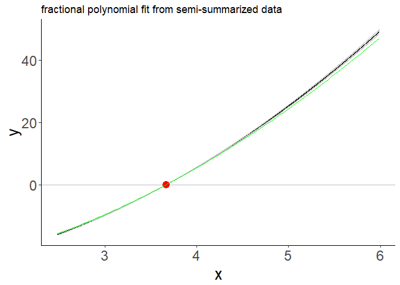
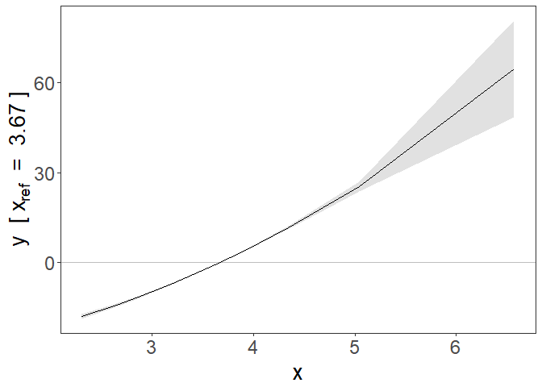

<!-- README.md is generated from README.Rmd. Please edit that file -->

# SUMnlmr

<!-- badges: start -->

<!-- badges: end -->

The goal of SUMnlmr is to allow investigations of potentially non-linear
relationships between an exposure and an outcome via a Mendelian
randomization framework, without requiring full access to individual
level genetic data.

It is based on the existing package for individual data by James Staley:
nlmr (available from <https://github.com/jrs95/nlmr> ).

The core concept is to split the process into two distinct halfs: one
requiring individual level data, which is converted into a
semi-summarized form (create\_nlmr\_summary) by dividing the population
into strata based on the IV-free exposure. Associations with the
exposure and the outcome are estimated in each stratum. In the second
half, this semi-summarized form can then be shared, without compromising
patient privacy, and investigated seperately using two IV methods: a
fractional polynomial method (frac\_poly\_summ\_mr) and a piecewise
linear method (piecewise\_summ\_mr). Both methods calculate a localised
causal effect (LACE). The piecewise method fits a continuous piecewise
linear function to these estimates, while the fractional polynomial
method fits the best 1 or 2 term fractional polynomial.

## Functions

*create\_nlmr\_summary* - prepares individual level data into
semi-summarised form, ready to fit nlmr models. *fracpoly\_summ\_mr* -
this method performs IV analysis using fractional polynomials
*piecewise\_summ\_mr* - this method performs IV analysis using piecewise
linear function

## Installation

You can install the released version of SUMnlmr from
[GitHub](https://github.com/) with:

``` r
# install.packages("devtools")
devtools::install_github("amymariemason/SUMnlmr")
```

## Example 1: Summarizing data

This is a basic example which shows you how to create the
semi-summarized data form. First we create some practise data:

``` r
library(SUMnlmr)
## create some data to practise on
test_data<-create_ind_data(N=10000, beta2=2, beta1=1)
# this creates quadratic.Y  = x + 2x^2 + errorY 
head(test_data)
#>   g         u    errorX     errorY        X linear.Y quadratic.Y   sqrt.Y
#> 1 0 0.0093567 0.5210849 -0.3073902 2.530442 2.230537    15.03681 1.290831
#> 2 0 0.8384207 0.3163078  1.1561246 3.154728 4.981590    24.88621 3.603017
#> 3 2 0.3239819 2.8228296  1.0392641 5.646811 6.945261    70.71822 3.674752
#> 4 1 0.1089678 1.3872201 -0.6140266 3.746188 3.219336    31.28718 1.408655
#> 5 1 0.8485065 1.0453099  0.7386257 4.143816 5.561247    39.90368 3.453068
#> 6 1 0.8463006 1.3204302  1.7315215 4.416731 6.825293    45.84031 4.510164
#>       log.Y threshold.Y fracpoly.Y
#> 1 0.6284889    2.230537   4.087324
#> 2 2.9757636    4.981590   7.279395
#> 3 3.0295407    6.945261  10.407443
#> 4 0.7938864    3.219336   5.860813
#> 5 2.8390481    5.561247   8.404482
#> 6 3.8939618    6.825293   9.796092
```

Then we use create\_nlmr\_summary to summarise it.

``` r

## create the summarized form
## 
summ_data<-create_nlmr_summary(y = test_data$quadratic.Y,
                                x = test_data$X,
                                g = test_data$g,
                                covar = NULL,
                                family = "gaussian",
                                q = 10)

head(summ_data)
#> $summary
#>           bx       by        bxse       byse   x0mean    xmean     xmin
#> 1  0.2584150 2.801564 0.005561533 0.07859202 2.471536 2.417419 2.011744
#> 2  0.2631777 3.198527 0.003205836 0.06307414 2.752097 2.736938 2.611710
#> 3  0.2648843 3.460101 0.002629087 0.05919822 2.962523 2.944752 2.851241
#> 4  0.2653223 3.657516 0.002272023 0.05928485 3.120428 3.121227 3.031660
#> 5  0.2643846 3.762814 0.002654531 0.06083758 3.294689 3.305914 3.215010
#> 6  0.2711610 4.049764 0.003174520 0.06565952 3.501757 3.514049 3.404039
#> 7  0.2580383 4.225651 0.004030163 0.08266982 3.757094 3.774415 3.636841
#> 8  0.2600053 4.586326 0.005809938 0.11517345 4.090245 4.106213 3.928387
#> 9  0.2503680 4.872431 0.009997521 0.20061794 4.624264 4.641532 4.322723
#> 10 0.2789643 7.414035 0.050953452 1.57115585 6.087095 6.099267 5.055921
#>         xmax
#> 1   2.611628
#> 2   2.851156
#> 3   3.031471
#> 4   3.214921
#> 5   3.403948
#> 6   3.635260
#> 7   3.927959
#> 8   4.321992
#> 9   5.055747
#> 10 13.686512
```

If we have co-variants we want to adjust for in our analysis, we need to
include them at this stage.

``` r

## create the summarized form
summ_covar<-create_nlmr_summary(y = test_data$quadratic.Y,
                                x = test_data$X,
                                g = test_data$g,
                                covar = matrix(data=c(test_data$linear.Y,
                                                      test_data$sqrt.Y),ncol=2),
                                family = "gaussian",
                                q = 10)

head(summ_covar)
#> $summary
#>             bx         by         bxse        byse   x0mean    xmean     xmin
#> 1  0.019164314 -2.1014510 2.535807e-03 0.438183834 3.442419 2.417419 2.011744
#> 2  0.008667079 -0.6578332 2.731001e-04 0.021105463 3.052627 2.736938 2.611710
#> 3  0.008340987 -0.6468961 1.763628e-04 0.014391428 3.196000 2.944752 2.851241
#> 4  0.008442577 -0.6858734 1.233431e-04 0.010736359 3.371220 3.121227 3.031660
#> 5  0.008585455 -0.7022235 1.117092e-04 0.009542159 3.479645 3.305914 3.215010
#> 6  0.008838229 -0.7598489 9.501105e-05 0.008723113 3.686184 3.514049 3.404039
#> 7  0.008474401 -0.7625645 8.700888e-05 0.007983452 3.910028 3.774415 3.636841
#> 8  0.008171579 -0.7374006 8.810946e-05 0.008238906 4.065200 4.106213 3.928387
#> 9  0.007586643 -0.6899666 1.158005e-04 0.010585833 4.181398 4.641532 4.322723
#> 10 0.002960818 -0.2751935 2.231147e-04 0.020612270 4.277005 6.099267 5.055921
#>         xmax
#> 1   2.611628
#> 2   2.851156
#> 3   3.031471
#> 4   3.214921
#> 5   3.403948
#> 6   3.635260
#> 7   3.927959
#> 8   4.321992
#> 9   5.055747
#> 10 13.686512
```

These have used a single genetic variant count, but the method works
identically with an genetic score function for g instead.

Once your data is in this format, the output data frame is all you need
to share to fit the fractional polynomial or piecewise linear models
onto the data.

## Example 2: Fitting a fractional polynomial model

Your data needs to be in the semi-summarised form as shown above. We can
then fit a fractional polynomial model:

``` r


model<- with(summ_data$summary, frac_poly_summ_mr(bx=bx,
                  by=by, 
                  bxse=bxse, 
                  byse=byse, 
                  xmean=xmean,
                  family="gaussian",
                  fig=TRUE)
)


summary(model)
#> Call: frac_poly_mr
#> 
#> Number of individuals: NA; Quantiles: 10; 95%CI: Model based SEs
#> 
#> Powers: 2
#> 
#> Coefficients:
#>   Estimate Std. Error 95%CI Lower 95%CI Upper   p.value    
#> 2 2.173124   0.014178    2.145334      2.2009 < 2.2e-16 ***
#> ---
#> Signif. codes:  0 '***' 0.001 '**' 0.01 '*' 0.05 '.' 0.1 ' ' 1
#> 
#> Non-linearity tests
#> Fractional polynomial degree p-value: 0.00699
#> Fractional polynomial non-linearity p-value: 0
#> Quadratic p-value: 1.53e-82
#> Cochran Q p-value: 0
#> 
#> Heterogeneity tests
#> Cochran Q p-value: 0.266
#> Trend p-value: 0.691
```

 This also
produces a graph of the fit with 95% confidence intervals. This is a
ggplot object and can be adjusted with ggplot commands

``` r
library(ggplot2)
f <- function(x) (x + 2*x^2 - mean(summ_data$summary$xmean) -
                    2*mean(summ_data$summary$xmean)^2 )

plot1 <- model$figure+ 
  stat_function(fun = f, colour = "green") +
  ggtitle("fractional polynomial fit from semi-summarized data")

plot1
```

 There is
also p-values provided in p\_test and p\_het. This is identical to the
testing provided by the nlmr package: \* fp\_d1\_d2 : test between the
fractional polynomial degrees \* fp : fractional polynomial
non-linearity test \* quad: quadratic test \* Q : Cochran Q test and \*
Q: Cochran Q heterogeneity test \* trend: trend test

``` r
model$p_tests
#>         fp_d1_d2 fp         quad Q
#> [1,] 0.006990917  0 1.525789e-82 0

model$p_heterogeneity
#>              Q     trend
#> [1,] 0.2655431 0.6911389
```

## Example 3: Piecewise linear model

We can instead fit a piecewise linear model to the same summarised data

``` r

model2 <-with(summ_data$summary, piecewise_summ_mr(by, bx, byse, bxse, x0mean, xmean, xmin,xmax, 
                  ci="bootstrap_se",
                  nboot=1000, 
                  fig=TRUE,
                  family="gaussian",
                  ci_fig="ribbon")
)

summary(model2)
#> Call: piecewise_mr
#> 
#> Number of individuals: ; Quantiles: 10; Number of bootstrap replications: 1000
#> 
#> LACE:
#>    Estimate Std. Error 95%CI Lower 95%CI Upper   p.value    
#> 1  10.59848    0.29732    10.00060      11.196 < 2.2e-16 ***
#> 2  12.10022    0.23861    11.61498      12.585 < 2.2e-16 ***
#> 3  13.08977    0.22395    12.63267      13.547 < 2.2e-16 ***
#> 4  13.83660    0.22428    13.37408      14.299 < 2.2e-16 ***
#> 5  14.23495    0.23015    13.78044      14.690 < 2.2e-16 ***
#> 6  15.32050    0.24839    14.81161      15.829 < 2.2e-16 ***
#> 7  15.98589    0.31274    15.35639      16.615 < 2.2e-16 ***
#> 8  17.35034    0.43571    16.49074      18.210 < 2.2e-16 ***
#> 9  18.43270    0.75895    16.90221      19.963 < 2.2e-16 ***
#> 10 28.04774    5.94378    16.41324      39.682 2.301e-06 ***
#> ---
#> Signif. codes:  0 '***' 0.001 '**' 0.01 '*' 0.05 '.' 0.1 ' ' 1
#> 
#> Non-linearity tests
#> Quadratic p-value: 2.95e-82
#> Cochran Q p-value: 0
#> 
#> Heterogeneity tests
#> Cochran Q p-value: 0.266
#> Trend p-value: 0.608
```

 Again the
figure is a ggplot object and can be adjusted similarly.

``` r
plot2 <- model2$figure+ 
  stat_function(fun = f, colour = "green") +
  ggtitle("piecewise linear fit from semi-summarized data")

plot2
```


## Example 4: Binary outcome

The functions above can also fit binary outcome data, via a generalised
linear model.

``` r

test_data$y.bin<-stats::rbinom(size=1, p=0.5, n=10000)

# create semo-summ data
summ_bin<-create_nlmr_summary(y = test_data$y.bin,
                                x = test_data$X,
                                g = test_data$g,
                                covar = NULL,
                                family = "binomial",
                                q = 10)

# fit fractional poly model


model3<- with(summ_bin$summary,frac_poly_summ_mr(bx=bx,
                  by=by, 
                  bxse=bxse, 
                  byse=byse, 
                  xmean=xmean,
                  family="binomial",
                  fig=TRUE)
)

summary(model3)
#> Call: frac_poly_mr
#> 
#> Number of individuals: NA; Quantiles: 10; 95%CI: Model based SEs
#> 
#> Powers: -2
#> 
#> Coefficients:
#>    Estimate Std. Error 95%CI Lower 95%CI Upper p.value
#> -2  2.52733    1.66136    -0.72893      5.7836  0.1282
#> 
#> Non-linearity tests
#> Fractional polynomial degree p-value: 0.895
#> Fractional polynomial non-linearity p-value: 0.383
#> Quadratic p-value: 0.847
#> Cochran Q p-value: 0.499
#> 
#> Heterogeneity tests
#> Cochran Q p-value: 0.276
#> Trend p-value: 0.614
```

 Not
unsurprisingly, we find no evidence of an effect, causal or otherwise,
as the binary outcome was randomly distributed.

If we look instead at the semi-summarised UK Biobank datasets on
LDL-cholesterol and CAD, one with and one without covariates. Here we
can see a potentially non-linear trend in the univariate data, which
becomes a clear linear trend once covariates are included.

``` r

# fit piecewise linear model
model4 <-with(LDL_CAD, piecewise_summ_mr(by, bx, byse, bxse, x0mean, xmean, xmin,xmax, 
                  ci="bootstrap_se",
                  nboot=1000, 
                  fig=TRUE,
                  family="gaussian",
                  ci_fig="ribbon")
)


summary(model4)
#> Call: piecewise_mr
#> 
#> Number of individuals: ; Quantiles: 10; Number of bootstrap replications: 1000
#> 
#> LACE:
#>     Estimate Std. Error 95%CI Lower 95%CI Upper   p.value    
#> 1   0.406261   0.059553    0.293183      0.5193 1.898e-12 ***
#> 2   0.362442   0.073477    0.213547      0.5113 1.833e-06 ***
#> 3   0.311077   0.087016    0.140636      0.4815 0.0003472 ***
#> 4   0.286820   0.096907    0.089165      0.4845 0.0044526 ** 
#> 5   0.152663   0.101981   -0.047379      0.3527 0.1347099    
#> 6   0.141322   0.105426   -0.060427      0.3431 0.1697676    
#> 7   0.128421   0.102452   -0.067325      0.3242 0.1984850    
#> 8   0.191138   0.104945   -0.020045      0.4023 0.0760699 .  
#> 9   0.223650   0.104324    0.017333      0.4300 0.0336148 *  
#> 10  0.268987   0.098653    0.071417      0.4666 0.0076191 ** 
#> ---
#> Signif. codes:  0 '***' 0.001 '**' 0.01 '*' 0.05 '.' 0.1 ' ' 1
#> 
#> Non-linearity tests
#> Quadratic p-value: 0.0134
#> Cochran Q p-value: 0.193
#> 
#> Heterogeneity tests
#> Cochran Q p-value: 0
#> Trend p-value: 4.47e-19
```


``` r


# fit piecewise linear model
model5 <-with(LDL_CAD_covar,piecewise_summ_mr(by, bx, byse, bxse, x0mean, xmean, xmin,xmax, 
                  ci="bootstrap_se",
                  nboot=1000, 
                  fig=TRUE,
                  family="gaussian",
                  ci_fig="ribbon")
)

summary(model5)
#> Call: piecewise_mr
#> 
#> Number of individuals: ; Quantiles: 10; Number of bootstrap replications: 1000
#> 
#> LACE:
#>     Estimate Std. Error 95%CI Lower 95%CI Upper   p.value    
#> 1  0.3076383  0.0628626   0.1836448      0.4316 1.157e-06 ***
#> 2  0.2922888  0.0780399   0.1439336      0.4406 0.0001127 ***
#> 3  0.3579244  0.0915492   0.1826162      0.5332 6.289e-05 ***
#> 4  0.2152398  0.1014575   0.0061647      0.4243 0.0436130 *  
#> 5  0.2541277  0.1062581   0.0457689      0.4625 0.0168236 *  
#> 6  0.4308538  0.1079399   0.2206054      0.6411 5.906e-05 ***
#> 7  0.2584994  0.1068753   0.0490175      0.4680 0.0155791 *  
#> 8  0.2921218  0.1075173   0.0841165      0.5001 0.0059121 ** 
#> 9  0.3296967  0.1062308   0.1243339      0.5351 0.0016515 ** 
#> 10 0.3950466  0.1005297   0.2017337      0.5884 6.192e-05 ***
#> ---
#> Signif. codes:  0 '***' 0.001 '**' 0.01 '*' 0.05 '.' 0.1 ' ' 1
#> 
#> Non-linearity tests
#> Quadratic p-value: 0.555
#> Cochran Q p-value: 0.928
#> 
#> Heterogeneity tests
#> Cochran Q p-value: 0
#> Trend p-value: 7.45e-19
```


