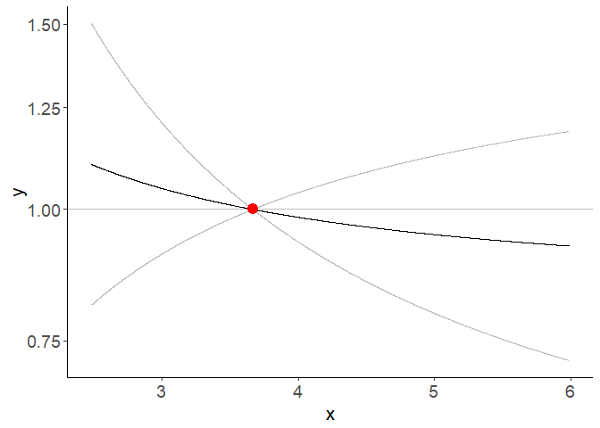

<!-- README.md is generated from README.Rmd. Please edit that file -->

# SUMnlmr

<!-- badges: start -->

<!-- badges: end -->

The goal of SUMnlmr is to allow investigations of potentially non-linear
relationships between an exposure and an outcome via a Mendelian
randomization framework, without requiring full access to individual
level genetic data.

It is based on the existing package for individual data by James Staley:
nlmr (available from <https://github.com/jrs95/nlmr> ).

The core concept is to split the process into two distinct halfs: one
requiring individual level data, which is converted into a
semi-summarized form (create\_nlmr\_summary) by dividing the population
into strata based on the IV-free exposure. Associations with the
exposure and the outcome are estimated in each stratum. In the second
half, this semi-summarized form can then be shared, without compromising
patient privacy, and investigated seperately using two IV methods: a
fractional polynomial method (frac\_poly\_summ\_mr) and a piecewise
linear method (piecewise\_summ\_mr). Both methods calculate a localised
causal effect (LACE). The piecewise method fits a continuous piecewise
linear function to these estimates, while the fractional polynomial
method fits the best 1 or 2 term fractional polynomial.

## Functions

*create\_nlmr\_summary* - prepares individual level data into
semi-summarised form, ready to fit nlmr models. *fracpoly\_summ\_mr* -
this method performs IV analysis using fractional polynomials
*piecewise\_summ\_mr* - this method performs IV analysis using piecewise
linear function

## Installation

You can install the released version of SUMnlmr from
[GitHub](https://github.com/) with:

``` r
# install.packages("devtools")
devtools::install_github("amymariemason/SUMnlmr")
```

## Example 1: Summarizing data

This is a basic example which shows you how to create the
semi-summarized data form. First we create some practise data:

``` r
library(SUMnlmr)
## create some data to practise on
test_data<-create_ind_data(N=10000, beta2=2, beta1=1)
# this creates quadratic.Y  = x + 2x^2 + errorY 
head(test_data)
#>   g          u    errorX      errorY        X linear.Y quadratic.Y    sqrt.Y
#> 1 2 0.23514002 0.0748216 -0.59156575 2.809962 2.406508    18.19828 1.2728403
#> 2 1 0.18941186 0.1848965 -0.57572876 2.624308 2.200109    15.97410 1.1957725
#> 3 0 0.05089268 1.7024419  2.11611839 3.753335 5.910167    34.08521 4.0941850
#> 4 1 0.86949288 0.4375830  0.92558919 3.557076 5.178259    30.48384 3.5072047
#> 5 0 0.24796418 0.6760638 -0.01986705 2.924028 3.102532    20.20241 1.8884832
#> 6 0 0.08891108 0.3238427 -1.19188650 2.412754 1.291996    12.93476 0.4325465
#>        log.Y threshold.Y fracpoly.Y
#> 1  0.6297171    2.406508   4.472850
#> 2  0.5406181    2.200109   4.129744
#> 3  3.4794772    5.910167   8.555456
#> 4  2.8901223    5.178259   7.716137
#> 5  1.2514664    3.102532   5.248457
#> 6 -0.2399889    1.291996   3.053534
```

Then we use create\_nlmr\_summary to summarise it.

``` r

## create the summarized form
## 
summ_data<-create_nlmr_summary(y = test_data$quadratic.Y,
                                x = test_data$X,
                                g = test_data$g,
                                covar = NULL,
                                family = "gaussian",
                                controlsonly = FALSE,
                                q = 10)

head(summ_data)
#> $summary
#>           bx       by        bxse       byse    xmean     xmin     xmax
#> 1  0.2426369 2.636701 0.005417508 0.07770806 2.459342 2.299668 2.697445
#> 2  0.2346570 2.857204 0.003117275 0.06105554 2.726723 2.529640 2.931014
#> 3  0.2405117 3.122162 0.002684119 0.06030403 2.935859 2.738430 3.112755
#> 4  0.2351513 3.229327 0.002242008 0.05980793 3.111572 2.924886 3.361125
#> 5  0.2326240 3.268896 0.002512002 0.06398725 3.272659 3.084279 3.453572
#> 6  0.2350615 3.521094 0.003237663 0.06889345 3.476662 3.271163 3.688989
#> 7  0.2348803 3.804072 0.004006596 0.08120718 3.730019 3.503808 3.954511
#> 8  0.2319547 4.052582 0.005600817 0.10805541 4.058995 3.809014 4.308042
#> 9  0.2372704 4.611073 0.009478421 0.19310762 4.585793 4.244754 4.930739
#> 10 0.1428170 3.064846 0.053839414 1.70225768 5.973623 5.048069 6.509263
```

If we have co-variants we want to adjust for in our analysis, we need to
include them at this stage.

``` r

## create the summarized form
summ_covar<-create_nlmr_summary(y = test_data$quadratic.Y,
                                x = test_data$X,
                                g = test_data$g,
                                covar = matrix(data=c(test_data$linear.Y,
                                                      test_data$sqrt.Y),ncol=2),
                                family = "gaussian",
                                q = 10)

head(summ_covar)
#> $summary
#>             bx         by         bxse        byse    xmean     xmin     xmax
#> 1  0.024693684 -3.0940033 2.576051e-03 0.480737859 3.335774 2.299668 7.225763
#> 2  0.009639072 -0.7252159 2.539712e-04 0.019742975 3.003708 2.556269 2.938042
#> 3  0.009410051 -0.7295432 1.777940e-04 0.014526360 3.195048 2.740037 3.293981
#> 4  0.009356728 -0.7463530 1.266902e-04 0.010946107 3.345138 2.905345 5.416686
#> 5  0.009298094 -0.7574547 1.100301e-04 0.009455586 3.459360 3.036941 5.175000
#> 6  0.009235606 -0.7815219 9.653557e-05 0.008644825 3.652110 3.174821 5.150340
#> 7  0.009218495 -0.8166449 8.355187e-05 0.007800109 3.918313 3.314028 5.122759
#> 8  0.008770765 -0.7831802 9.551982e-05 0.008856850 4.013120 3.453870 4.933878
#> 9  0.008361042 -0.7576824 1.180254e-04 0.010751264 4.156118 3.614199 4.863260
#> 10 0.002703735 -0.2457555 2.497939e-04 0.022695737 4.252558 3.819090 4.566701
```

These have used a single genetic variant count, but the method works
identically with an genetic score function for g instead.

Once your data is in this format, the output data frame is all you need
to share to fit the fractional polynomial or piecewise linear models
onto the data.

## Example 2: Fitting a fractional polynomial model

Your data needs to be in the semi-summarised form as shown above. We can
then fit a fractional polynomial model:

``` r


model<- with(summ_data$summary, frac_poly_summ_mr(bx=bx,
                  by=by, 
                  bxse=bxse, 
                  byse=byse, 
                  xmean=xmean,
                  family="gaussian",
                  fig=TRUE)
)


summary(model)
#> Call: frac_poly_mr
#> 
#> Number of individuals: NA; Quantiles: 10; 95%CI: Model based SEs
#> 
#> Powers: 2
#> 
#> Coefficients:
#>   Estimate Std. Error 95%CI Lower 95%CI Upper   p.value    
#> 2 2.181430   0.016117    2.149841       2.213 < 2.2e-16 ***
#> ---
#> Signif. codes:  0 '***' 0.001 '**' 0.01 '*' 0.05 '.' 0.1 ' ' 1
#> 
#> Non-linearity tests
#> Fractional polynomial degree p-value: 0.0229
#> Fractional polynomial non-linearity p-value: 0
#> Quadratic p-value: 1.78e-60
#> Cochran Q p-value: 0
#> 
#> Heterogeneity tests
#> Cochran Q p-value: 0.346
#> Trend p-value: 0.129
```

 This also
produces a graph of the fit with 95% confidence intervals. This is a
ggplot object and can be adjusted with ggplot commands

``` r
library(ggplot2)
f <- function(x) (x + 2*x^2 - mean(summ_data$summary$xmean) -
                    2*mean(summ_data$summary$xmean)^2 )

plot1 <- model$figure+ 
  stat_function(fun = f, colour = "green") +
  ggtitle("fractional polynomial fit from semi-summarized data")

plot1
```

 There is
also p-values provided in p\_test and p\_het. This is identical to the
testing provided by the nlmr package: \* fp\_d1\_d2 : test between the
fractional polynomial degrees \* fp : fractional polynomial
non-linearity test \* quad: quadratic test \* Q : Cochran Q test and \*
Q: Cochran Q heterogeneity test \* trend: trend test

``` r
model$p_tests
#>        fp_d1_d2 fp         quad Q
#> [1,] 0.02294777  0 1.781955e-60 0

model$p_heterogeneity
#>              Q     trend
#> [1,] 0.3461578 0.1293188
```

## Example 3: Piecewise linear model

We can instead fit a piecewise linear model to the same summarised data

``` r

model2 <-with(summ_data$summary, piecewise_summ_mr(by, bx, byse, bxse, xmean, xmin,xmax, 
                  ci="bootstrap_se",
                  nboot=1000, 
                  fig=TRUE,
                  family="gaussian",
                  ci_fig="ribbon")
)

summary(model2)
#> $model
#>    q nboot
#> 1 10  1000
#> 
#> $coefficients
#>        beta        se        lci      uci          pval
#> 1  11.18928 0.3297671 10.5170539 11.86151 1.853983e-233
#> 2  12.12502 0.2590994 11.6143627 12.63568  0.000000e+00
#> 3  13.24942 0.2559102 12.7420916 13.75674  0.000000e+00
#> 4  13.70419 0.2538049 13.2007939 14.20759  0.000000e+00
#> 5  13.87210 0.2715406 13.3398802 14.40433  0.000000e+00
#> 6  14.94235 0.2923609 14.3171802 15.56752  0.000000e+00
#> 7  16.14322 0.3446162 15.4465458 16.83989  0.000000e+00
#> 8  17.19781 0.4585512 16.2669601 18.12866 3.977674e-287
#> 9  19.56786 0.8194844 18.0111217 21.12460 5.100253e-134
#> 10 13.00619 7.2238146 -0.9132326 26.92560  6.703978e-02
#> 
#> $p_tests
#>           quad Q
#> 1 1.781955e-60 0
#> 
#> $p_heterogeneity
#>           Q     trend
#> 1 0.3461578 0.1293188
#> 
#> $figure
```


    #> 
    #> attr(,"class")
    #> [1] "summary.piecewise_mr"

Again the figure is a ggplot object and can be adjusted similarly.

``` r
plot2 <- model2$figure+ 
  stat_function(fun = f, colour = "green") +
  ggtitle("piecewise linear fit from semi-summarized data")

plot2
```


## Example 4: Binary outcome

The functions above can also fit binary outcome data, via a generalised
linear model.

``` r

test_data$y.bin<-stats::rbinom(size=1, p=0.5, n=10000)

# create semo-summ data
summ_bin<-create_nlmr_summary(y = test_data$y.bin,
                                x = test_data$X,
                                g = test_data$g,
                                covar = NULL,
                                family = "binomial",
                                q = 10)

# fit fractional poly model


model3<- with(summ_bin$summary,frac_poly_summ_mr(bx=bx,
                  by=by, 
                  bxse=bxse, 
                  byse=byse, 
                  xmean=xmean,
                  family="binomial",
                  fig=TRUE)
)

summary(model3)
#> Call: frac_poly_mr
#> 
#> Number of individuals: NA; Quantiles: 10; 95%CI: Model based SEs
#> 
#> Powers: 3
#> 
#> Coefficients:
#>     Estimate Std. Error 95%CI Lower 95%CI Upper p.value
#> 3 -0.0015174  0.0024990  -0.0064154      0.0034  0.5437
#> 
#> Non-linearity tests
#> Fractional polynomial degree p-value: 0.759
#> Fractional polynomial non-linearity p-value: 0.557
#> Quadratic p-value: 0.345
#> Cochran Q p-value: 0.684
#> 
#> Heterogeneity tests
#> Cochran Q p-value: 0.648
#> Trend p-value: 0.401
```

 Not
unsurprisingly, we find no evidence of an effect, causal or otherwise,
as the binary outcome was randomly distributed.

If we look instead at the semi-summarised UK Biobank datasets on
LDL-cholesterol and CAD, one with and one without covariates. Here we
can see a potentially non-linear trend in the univariate data, which
becomes a clear linear trend once covariates are included.

``` r

# fit piecewise linear model
model4 <-with(LDL_CAD, piecewise_summ_mr(by, bx, byse, bxse, xmean, xmin,xmax, 
                  ci="bootstrap_se",
                  nboot=1000, 
                  fig=TRUE,
                  family="gaussian",
                  ci_fig="ribbon")
)


summary(model4)
#> $model
#>    q nboot
#> 1 10  1000
#> 
#> $coefficients
#>         beta         se         lci       uci         pval
#> 1  0.4062614 0.05955269  0.28838212 0.5241407 1.428534e-11
#> 2  0.3624422 0.07347687  0.21596666 0.5089177 1.235447e-06
#> 3  0.3110766 0.08701566  0.13943393 0.4827193 3.820155e-04
#> 4  0.2868202 0.09690730  0.10106114 0.4725793 2.475449e-03
#> 5  0.1526631 0.10198090 -0.04960958 0.3549358 1.390632e-01
#> 6  0.1413218 0.10542626 -0.06964045 0.3522840 1.891873e-01
#> 7  0.1284211 0.10245230 -0.07196184 0.3288041 2.090718e-01
#> 8  0.1911379 0.10494505 -0.01631576 0.3985916 7.094169e-02
#> 9  0.2236501 0.10432433  0.02059804 0.4267021 3.086362e-02
#> 10 0.2689869 0.09865336  0.07558401 0.4623899 6.410898e-03
#> 
#> $p_tests
#>        quad         Q
#> 1 0.0129998 0.1926024
#> 
#> $p_heterogeneity
#>   Q        trend
#> 1 0 3.752917e-19
#> 
#> $figure
```


    #> 
    #> attr(,"class")
    #> [1] "summary.piecewise_mr"
    
    
    # fit piecewise linear model
    model5 <-with(LDL_CAD_covar,piecewise_summ_mr(by, bx, byse, bxse, xmean, xmin,xmax, 
                      ci="bootstrap_se",
                      nboot=1000, 
                      fig=TRUE,
                      family="gaussian",
                      ci_fig="ribbon")
    )
    
    summary(model5)
    #> $model
    #>    q nboot
    #> 1 10  1000
    #> 
    #> $coefficients
    #>         beta         se        lci       uci         pval
    #> 1  0.3076383 0.06286262 0.18554776 0.4297288 7.863668e-07
    #> 2  0.2922888 0.07803988 0.14059209 0.4439854 1.590328e-04
    #> 3  0.3579244 0.09154918 0.17550606 0.5403426 1.201934e-04
    #> 4  0.2152398 0.10145750 0.02009229 0.4103874 3.063355e-02
    #> 5  0.2541277 0.10625811 0.04486077 0.4633947 1.730479e-02
    #> 6  0.4308538 0.10793986 0.21682647 0.6448812 7.958935e-05
    #> 7  0.2584994 0.10687532 0.04191673 0.4750821 1.931825e-02
    #> 8  0.2921218 0.10751727 0.08201864 0.5022249 6.427587e-03
    #> 9  0.3296967 0.10623077 0.12564566 0.5337477 1.540828e-03
    #> 10 0.3950466 0.10052968 0.19678580 0.5933074 9.406263e-05
    #> 
    #> $p_tests
    #>        quad         Q
    #> 1 0.5564354 0.9280444
    #> 
    #> $p_heterogeneity
    #>   Q        trend
    #> 1 0 5.974956e-19
    #> 
    #> $figure


    #> 
    #> attr(,"class")
    #> [1] "summary.piecewise_mr"
