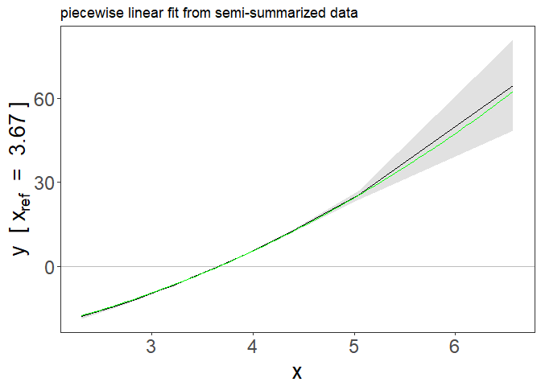
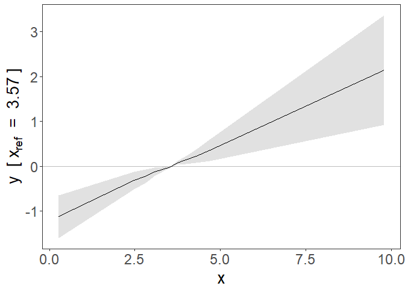

<!-- README.md is generated from README.Rmd. Please edit that file -->

# SUMnlmr

<!-- badges: start -->
<!-- badges: end -->

The goal of SUMnlmr is to allow investigations of potentially non-linear
relationships between an exposure and an outcome via a Mendelian
randomization framework, without requiring full access to individual
level genetic data.

It is based on the existing package for individual data by James Staley:
nlmr (available from <https://github.com/jrs95/nlmr> ).

The core concept is to split the process into two distinct halfs: one
requiring individual level data, which is converted into a
semi-summarized form (create_nlmr_summary) by dividing the population
into strata based on the IV-free exposure. Associations with the
exposure and the outcome are estimated in each stratum. In the second
half, this semi-summarized form can then be shared, without compromising
patient privacy, and investigated seperately using two IV methods: a
fractional polynomial method (frac_poly_summ_mr) and a piecewise linear
method (piecewise_summ_mr). Both methods calculate a localised causal
effect (LACE). The piecewise method fits a continuous piecewise linear
function to these estimates, while the fractional polynomial method fits
the best 1 or 2 term fractional polynomial.

## Functions

*create_nlmr_summary* - prepares individual level data into
semi-summarised form, ready to fit nlmr models. *fracpoly_summ_mr* -
this method performs IV analysis using fractional polynomials
*piecewise_summ_mr* - this method performs IV analysis using piecewise
linear function

## Installation

You can install the released version of SUMnlmr from
[GitHub](https://github.com/) with:

``` r
# install.packages("devtools")
devtools::install_github("amymariemason/SUMnlmr")
```

## Example 1: Summarizing data

This is a basic example which shows you how to create the
semi-summarized data form. First we create some practise data:

``` r
library(SUMnlmr)
## create some data to practise on
test_data<-create_ind_data(N=10000, beta2=2, beta1=1)
# this creates quadratic.Y  = x + 2x^2 + errorY 
head(test_data)
#>   g          u     errorX     errorY        X   linear.Y quadratic.Y     sqrt.Y
#> 1 0 0.08176809 0.33506643  0.7479011 2.416835  3.2301501   14.912328  2.3679328
#> 2 0 0.05094785 0.04967857 -2.3376386 2.100626 -0.1962539    8.629009 -0.8475266
#> 3 1 0.47509705 0.37975491  0.1741544 3.104852  3.6590840   22.939295  2.3162911
#> 4 1 0.54009755 0.06044085 -0.9746320 2.850538  2.3079845   18.559123  1.1457998
#> 5 0 0.26491080 1.07224939  0.1533780 3.337160  3.7024668   25.975743  2.1920962
#> 6 1 0.18903041 2.52983035  1.9123808 4.968861  7.0324659   56.411620  4.2926993
#>       log.Y threshold.Y fracpoly.Y
#> 1  1.695774   3.2301501   4.995067
#> 2 -1.554645  -0.1962539   1.288217
#> 3  1.687198   3.6590840   5.925016
#> 4  0.504954   2.3079845   4.403000
#> 5  1.570427   3.7024668   6.112707
#> 6  3.666796   7.0324659  10.238847
```

Then we use create_nlmr_summary to summarise it.

``` r
## create the summarized form
## 
summ_data<-create_nlmr_summary(y = test_data$quadratic.Y,
                                x = test_data$X,
                                g = test_data$g,
                                covar = NULL,
                                family = "gaussian",
                                controlsonly = FALSE,
                                q = 10)

head(summ_data$summary)
#>          bx       by        bxse       byse    xmean     xmin     xmax
#> 1 0.2416460 2.621907 0.005469282 0.07992635 2.468141 2.303684 2.702574
#> 2 0.2380237 2.953103 0.003021858 0.06259026 2.743192 2.537307 2.932261
#> 3 0.2359926 3.000799 0.002688455 0.06213654 2.941619 2.744584 3.123951
#> 4 0.2383464 3.220525 0.002288068 0.06001303 3.114386 2.925759 3.284940
#> 5 0.2372240 3.399922 0.002456162 0.06396262 3.284897 3.094661 3.454451
#> 6 0.2320859 3.535823 0.003024663 0.06594482 3.490322 3.278736 3.720013
```

If we have co-variants we want to adjust for in our analysis, we need to
include them at this stage.

``` r
## create the summarized form
summ_covar<-create_nlmr_summary(y = test_data$quadratic.Y,
                                x = test_data$X,
                                g = test_data$g,
                                covar = matrix(data=c(test_data$linear.Y,
                                                      test_data$sqrt.Y),ncol=2),
                                family = "gaussian",
                                q = 10)

head(summ_covar$summary)
#>            bx         by         bxse        byse    xmean     xmin     xmax
#> 1 0.017039513 -1.5750884 2.030203e-03 0.298694492 3.535173 2.303684 7.250644
#> 2 0.008085241 -0.5922459 2.734618e-04 0.020351214 2.981956 2.554048 2.882983
#> 3 0.007665114 -0.5765070 1.650736e-04 0.012717338 3.186438 2.749049 5.580242
#> 4 0.007849691 -0.6160094 1.218489e-04 0.009940171 3.300218 2.911292 3.411314
#> 5 0.007581952 -0.6195833 9.975637e-05 0.008606957 3.516460 3.046373 5.344659
#> 6 0.007733693 -0.6509976 8.643375e-05 0.007694611 3.690165 3.173837 5.190605
```

Note: Because the covariants are included as a matrix, lm cannot detect
factor variables and create automatic dummy variables for them. The
easiest way to include factor variables is to make these dummy variables
by hand instead using the
[model.matrix](https://stat.ethz.ch/R-manual/R-devel/library/stats/html/model.matrix.html)
command. e.g.

``` r
## create a factor
test_data$centre<- as.factor(rbinom(nrow(test_data),4, 0.5))

#turn factor into binary contrasts against first factor
dummies<- model.matrix(~centre,data=test_data)[,2:5]

summ_covar2<-create_nlmr_summary(y = test_data$quadratic.Y,
                                 x = test_data$X,
                                 g = test_data$g,
                                 covar = dummies,
                                 family = "gaussian",
                                 q = 10)

head(summ_covar2$summary)
#>          bx       by        bxse       byse    xmean     xmin     xmax
#> 1 0.2407786 2.616141 0.005540450 0.08092276 2.469080 2.303684 2.705564
#> 2 0.2353140 2.922645 0.003095423 0.06228917 2.741860 2.536890 2.937293
#> 3 0.2359986 3.000720 0.002652564 0.06143892 2.944478 2.746460 3.142854
#> 4 0.2374883 3.203621 0.002287410 0.06050652 3.112734 2.924474 3.292102
#> 5 0.2368943 3.394541 0.002481766 0.06380754 3.284772 3.093927 3.462022
#> 6 0.2313379 3.503267 0.002979733 0.06481999 3.490705 3.278736 3.720520
```

These have used a single genetic variant count, but the method works
identically with an genetic score function for g instead.

Once your data is in this format, the output data frame is all you need
to share to fit the fractional polynomial or piecewise linear models
onto the data.

## Example 2: Fitting a fractional polynomial model

Your data needs to be in the semi-summarised form as shown above. We can
then fit a fractional polynomial model:

``` r

model<- with(summ_data$summary, frac_poly_summ_mr(bx=bx,
                  by=by, 
                  bxse=bxse, 
                  byse=byse, 
                  xmean=xmean,
                  family="gaussian",
                  fig=TRUE)
)


summary(model)
#> Call: frac_poly_mr
#> 
#> Number of individuals: NA; Quantiles: 10; 95%CI: Model based SEs
#> 
#> Powers: 2
#> 
#> Coefficients:
#>   Estimate Std. Error 95%CI Lower 95%CI Upper   p.value    
#> 2 2.180494   0.016033    2.149069      2.2119 < 2.2e-16 ***
#> ---
#> Signif. codes:  0 '***' 0.001 '**' 0.01 '*' 0.05 '.' 0.1 ' ' 1
#> 
#> Non-linearity tests
#> Fractional polynomial degree p-value: 0.0767
#> Fractional polynomial non-linearity p-value: 0
#> Quadratic p-value: 1.21e-68
#> Cochran Q p-value: 0
#> 
#> Heterogeneity tests
#> Cochran Q p-value: 0.222
#> Trend p-value: 0.308
```

 This also
produces a graph of the fit with 95% confidence intervals. This is a
ggplot object and can be adjusted with ggplot commands

``` r
library(ggplot2)
f <- function(x) (x + 2*x^2 - mean(summ_data$summary$xmean) -
                    2*mean(summ_data$summary$xmean)^2 )

plot1 <- model$figure+ 
  stat_function(fun = f, colour = "green") +
  ggtitle("fractional polynomial fit from semi-summarized data")

plot1
```

 There is
also p-values provided in p_test and p_het. This is identical to the
testing provided by the nlmr package: \* fp_d1_d2 : test between the
fractional polynomial degrees \* fp : fractional polynomial
non-linearity test \* quad: quadratic test \* Q : Cochran Q test and \*
Q: Cochran Q heterogeneity test \* trend: trend test

``` r
model$p_tests
#>        fp_d1_d2 fp         quad Q
#> [1,] 0.07673496  0 1.206234e-68 0

model$p_heterogeneity
#>              Q     trend
#> [1,] 0.2215729 0.3076563
```

## Example 3: Piecewise linear model

We can instead fit a piecewise linear model to the same summarised data

``` r
model2 <-with(summ_data$summary, piecewise_summ_mr(by, bx, byse, bxse, xmean, xmin,xmax, 
                  ci="bootstrap_se",
                  nboot=1000, 
                  fig=TRUE,
                  family="gaussian",
                  ci_fig="ribbon")
)

summary(model2)
#> $model
#>    q nboot
#> 1 10  1000
#> 
#> $coefficients
#>        beta        se      lci      uci          pval
#> 1  11.08331 0.3378643 10.43657 11.73006 2.469024e-247
#> 2  12.48335 0.2645813 11.95457 13.01212  0.000000e+00
#> 3  12.68496 0.2626633 12.16539 13.20454  0.000000e+00
#> 4  13.61379 0.2536868 13.10883 14.11875  0.000000e+00
#> 5  14.37213 0.2703825 13.84360 14.90067  0.000000e+00
#> 6  14.94662 0.2787617 14.41625 15.47699  0.000000e+00
#> 7  16.15416 0.3436795 15.49773 16.81059  0.000000e+00
#> 8  16.86772 0.4702393 15.96058 17.77485 8.158853e-291
#> 9  21.00741 0.7562974 19.49572 22.51909 2.339354e-163
#> 10 28.62799 5.6943996 17.19522 40.06076  9.205857e-07
#> 
#> $p_tests
#>           quad Q
#> 1 1.206234e-68 0
#> 
#> $p_heterogeneity
#>           Q     trend
#> 1 0.2215729 0.4375517
#> 
#> $figure
```


    #> 
    #> attr(,"class")
    #> [1] "summary.piecewise_mr"

Again the figure is a ggplot object and can be adjusted similarly.

``` r
plot2 <- model2$figure+ 
  stat_function(fun = f, colour = "green") +
  ggtitle("piecewise linear fit from semi-summarized data")

plot2
```



## Example 4: Binary outcome

The functions above can also fit binary outcome data, via a generalised
linear model.

``` r
test_data$y.bin<-stats::rbinom(size=1, p=0.5, n=10000)

# create summ data
summ_bin<-create_nlmr_summary(y = test_data$y.bin,
                                x = test_data$X,
                                g = test_data$g,
                                covar = NULL,
                                family = "binomial",
                                q = 10)

# fit fractional poly model


model3<- with(summ_bin$summary,frac_poly_summ_mr(bx=bx,
                  by=by, 
                  bxse=bxse, 
                  byse=byse, 
                  xmean=xmean,
                  family="binomial",
                  fig=TRUE)
)

summary(model3)
#> Call: frac_poly_mr
#> 
#> Number of individuals: NA; Quantiles: 10; 95%CI: Model based SEs
#> 
#> Powers: 0
#> 
#> Coefficients:
#>   Estimate Std. Error 95%CI Lower 95%CI Upper p.value
#> 0 -0.31433    0.49504    -1.28460      0.6559  0.5254
#> 
#> Non-linearity tests
#> Fractional polynomial degree p-value: 0.0639
#> Fractional polynomial non-linearity p-value: 0.695
#> Quadratic p-value: 0.147
#> Cochran Q p-value: 0.11
#> 
#> Heterogeneity tests
#> Cochran Q p-value: 0.0436
#> Trend p-value: 0.00825
```

 Not
unsurprisingly, we find no evidence of an effect, causal or otherwise,
as the binary outcome was randomly distributed.

If we look instead at the semi-summarised UK Biobank datasets on
LDL-cholesterol and CAD, one with and one without covariates. Here we
can see a potentially non-linear trend in the univariate data, which
becomes a clear linear trend once covariates are included.

``` r
# fit piecewise linear model
model4 <-with(LDL_CAD, piecewise_summ_mr(by, bx, byse, bxse, xmean, xmin,xmax, 
                  ci="bootstrap_se",
                  nboot=1000, 
                  fig=TRUE,
                  family="gaussian",
                  ci_fig="ribbon")
)


summary(model4)
#> $model
#>    q nboot
#> 1 10  1000
#> 
#> $coefficients
#>         beta         se         lci       uci         pval
#> 1  0.4062614 0.05955269  0.29040412 0.5221187 6.292154e-12
#> 2  0.3624422 0.07347687  0.21619444 0.5086899 1.189252e-06
#> 3  0.3110766 0.08701566  0.13573948 0.4864137 5.063790e-04
#> 4  0.2868202 0.09690730  0.09581614 0.4778243 3.248143e-03
#> 5  0.1526631 0.10198090 -0.04952810 0.3548544 1.389040e-01
#> 6  0.1413218 0.10542626 -0.06586389 0.3485075 1.812487e-01
#> 7  0.1284211 0.10245230 -0.07419366 0.3310359 2.141312e-01
#> 8  0.1911379 0.10494505 -0.01443476 0.3967106 6.839824e-02
#> 9  0.2236501 0.10432433  0.02576157 0.4215386 2.674928e-02
#> 10 0.2689869 0.09865336  0.08402228 0.4539516 4.367085e-03
#> 
#> $p_tests
#>        quad         Q
#> 1 0.0129998 0.1926024
#> 
#> $p_heterogeneity
#>   Q        trend
#> 1 0 3.752917e-19
#> 
#> $figure
```


    #> 
    #> attr(,"class")
    #> [1] "summary.piecewise_mr"


    # fit piecewise linear model
    model5 <-with(LDL_CAD_covar,piecewise_summ_mr(by, bx, byse, bxse, xmean, xmin,xmax, 
                      ci="bootstrap_se",
                      nboot=1000, 
                      fig=TRUE,
                      family="gaussian",
                      ci_fig="ribbon")
    )

    summary(model5)
    #> $model
    #>    q nboot
    #> 1 10  1000
    #> 
    #> $coefficients
    #>         beta         se        lci       uci         pval
    #> 1  0.3076383 0.06286262 0.18784690 0.4274297 4.815824e-07
    #> 2  0.2922888 0.07803988 0.13947353 0.4451040 1.776260e-04
    #> 3  0.3579244 0.09154918 0.17641644 0.5394323 1.110801e-04
    #> 4  0.2152398 0.10145750 0.01300243 0.4174772 3.697734e-02
    #> 5  0.2541277 0.10625811 0.04861874 0.4596367 1.536366e-02
    #> 6  0.4308538 0.10793986 0.22746563 0.6342421 3.295421e-05
    #> 7  0.2584994 0.10687532 0.05409494 0.4629039 1.318595e-02
    #> 8  0.2921218 0.10751727 0.08608339 0.4981601 5.454444e-03
    #> 9  0.3296967 0.10623077 0.12599055 0.5334028 1.512660e-03
    #> 10 0.3950466 0.10052968 0.19535186 0.5947414 1.055898e-04
    #> 
    #> $p_tests
    #>        quad         Q
    #> 1 0.5564354 0.9280444
    #> 
    #> $p_heterogeneity
    #>   Q        trend
    #> 1 0 5.974956e-19
    #> 
    #> $figure



    #> 
    #> attr(,"class")
    #> [1] "summary.piecewise_mr"
