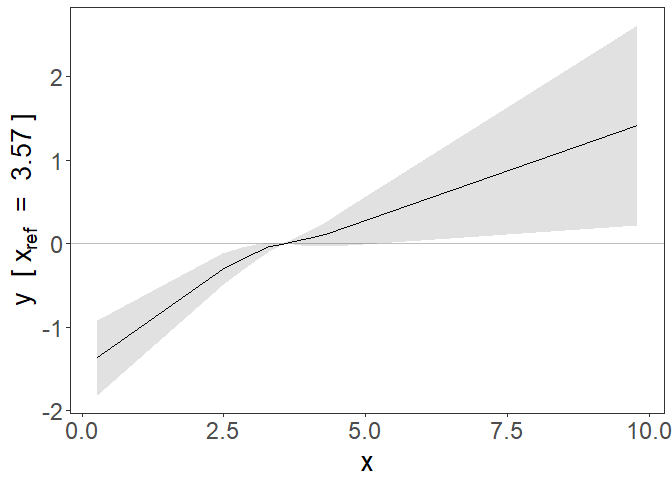

<!-- README.md is generated from README.Rmd. Please edit that file -->

# SUMnlmr

<!-- badges: start -->
<!-- badges: end -->

The goal of SUMnlmr is to allow investigations of potentially non-linear
relationships between an exposure and an outcome via a Mendelian
randomization framework, without requiring full access to individual
level genetic data.

It is based on the existing package for individual data by James Staley:
nlmr (available from <https://github.com/jrs95/nlmr> ).

The core concept is to split the process into two distinct halfs: one
requiring individual level data, which is converted into a
semi-summarized form (create_nlmr_summary) by dividing the population
into strata based on the IV-free exposure. Associations with the
exposure and the outcome are estimated in each stratum. In the second
half, this semi-summarized form can then be shared, without compromising
patient privacy, and investigated seperately using two IV methods: a
fractional polynomial method (frac_poly_summ_mr) and a piecewise linear
method (piecewise_summ_mr). Both methods calculate a localised causal
effect (LACE). The piecewise method fits a continuous piecewise linear
function to these estimates, while the fractional polynomial method fits
the best 1 or 2 term fractional polynomial.

## Functions

*create_nlmr_summary* - prepares individual level data into
semi-summarised form, ready to fit nlmr models. *fracpoly_summ_mr* -
this method performs IV analysis using fractional polynomials
*piecewise_summ_mr* - this method performs IV analysis using piecewise
linear function

## Installation

You can install the released version of SUMnlmr from
[GitHub](https://github.com/) with:

``` r
# install.packages("devtools")
devtools::install_github("amymariemason/SUMnlmr")
```

## Example 1: Summarizing data

This is a basic example which shows you how to create the
semi-summarized data form. First we create some practise data:

``` r
library(SUMnlmr)
## create some data to practise on
test_data<-create_ind_data(N=10000, beta2=2, beta1=1)
# this creates quadratic.Y  = x + 2x^2 + errorY 
head(test_data)
#>   g           u      errorX      errorY        X linear.Y quadratic.Y   sqrt.Y
#> 1 0 0.855429126 0.281309187 -0.08097275 3.136738 3.740109    23.41836 2.374454
#> 2 1 0.701815092 0.123178790  3.82412182 3.074994 7.460568    26.37174 6.139140
#> 3 0 0.844505128 0.269158502 -1.22821961 3.113664 2.561048    21.95085 1.211942
#> 4 0 0.894532484 1.062569070 -1.35964713 3.957102 3.313080    34.63039 1.345225
#> 5 1 0.263973312 0.002066912 -0.18735766 2.516040 2.539861    15.20078 1.610024
#> 6 0 0.001373215 0.502596895 -0.39162587 2.503970 2.113443    14.65318 1.191866
#>       log.Y threshold.Y fracpoly.Y
#> 1 1.7465541    3.740109   6.026476
#> 2 5.5088768    7.460568   9.707174
#> 3 0.5831845    2.561048   4.832648
#> 4 0.7314907    3.313080   6.064104
#> 5 0.9465073    2.539861   4.385234
#> 6 0.5273502    2.113443   3.949198
```

Then we use create_nlmr_summary to summarise it.

``` r

## create the summarized form
## 
summ_data<-create_nlmr_summary(y = test_data$quadratic.Y,
                                x = test_data$X,
                                g = test_data$g,
                                covar = NULL,
                                family = "gaussian",
                                strata_method = "residual", 
                                controlsonly = FALSE,
                                q = 10)

head(summ_data$summary)
#>          bx       by        bxse       byse    xmean     xmin     xmax
#> 1 0.2612326 2.896331 0.005904958 0.08345000 2.481251 2.310319 2.747010
#> 2 0.2663879 3.294415 0.002944422 0.06201941 2.767439 2.545732 2.969957
#> 3 0.2640439 3.553600 0.002562119 0.05966031 2.976237 2.757302 3.251028
#> 4 0.2653565 3.624811 0.002238094 0.05932379 3.138063 2.928119 3.320145
#> 5 0.2591934 3.819073 0.002752244 0.06177890 3.305293 3.093620 3.513066
#> 6 0.2627541 3.941553 0.003134800 0.06980488 3.512222 3.299559 3.720750
```

If we have co-variants we want to adjust for in our analysis, we need to
include them at this stage.

``` r

## create the summarized form
summ_covar<-create_nlmr_summary(y = test_data$quadratic.Y,
                                x = test_data$X,
                                g = test_data$g,
                                covar = matrix(data=c(test_data$linear.Y,
                                                      test_data$sqrt.Y),ncol=2),
                                family = "gaussian",
                                strata_method = "residual", 
                                q = 10)

head(summ_covar$summary)
#>            bx         by         bxse        byse    xmean     xmin     xmax
#> 1 0.015781437 -1.3644384 2.005148e-03 0.287822215 3.559852 2.310319 7.267194
#> 2 0.008905686 -0.6609827 2.640962e-04 0.019734263 3.093493 2.564498 6.009726
#> 3 0.008488032 -0.6495883 1.741300e-04 0.013646519 3.191837 2.768207 3.238514
#> 4 0.008330134 -0.6509645 1.148009e-04 0.009457052 3.385089 2.923985 5.544038
#> 5 0.008205053 -0.6693591 1.003678e-04 0.008945053 3.511726 3.060263 5.304315
#> 6 0.008172195 -0.6866536 8.233542e-05 0.007317054 3.703064 3.195215 5.171403
```

Note: Because the covariants are included as a matrix, lm cannot detect
factor variables and create automatic dummy variables for them. The
easiest way to include factor variables is to make these dummy variables
by hand instead using the
[model.matrix](https://stat.ethz.ch/R-manual/R-devel/library/stats/html/model.matrix.html)
command. e.g.

``` r

## create a factor
test_data$centre<- as.factor(rbinom(nrow(test_data),4, 0.5))

#turn factor into binary contrasts against first factor
dummies<- model.matrix(~centre,data=test_data)[,2:5]

summ_covar2<-create_nlmr_summary(y = test_data$quadratic.Y,
                                 x = test_data$X,
                                 g = test_data$g,
                                 covar = dummies,
                                 family = "gaussian",
                                 q = 10)

head(summ_covar2$summary)
#>          bx       by        bxse       byse    xmean     xmin     xmax
#> 1 0.2625992 2.929787 0.005864756 0.08316279 2.481824 2.310319 2.751725
#> 2 0.2688530 3.327042 0.002966458 0.06167005 2.771374 2.545798 2.991144
#> 3 0.2663097 3.580529 0.002603635 0.05905983 2.971824 2.754185 3.234841
#> 4 0.2641251 3.611746 0.002255262 0.05766441 3.137909 2.928976 3.340057
#> 5 0.2584143 3.793547 0.002753630 0.06212523 3.305805 3.094169 3.534874
#> 6 0.2619501 3.936336 0.003100198 0.06851265 3.512687 3.297890 3.729489
```

These have used a single genetic variant count, but the method works
identically with an genetic score function for g instead. Logistic or
cox models in the G-Y relationship can be used by changing the family
option - see details in the create_nlmr_summary function description.

It is also possible to implement the doubly-ranked method described in
Haodong’s paper
<https://www.biorxiv.org/content/10.1101/2022.06.28.497930v1>

``` r

## create the summarized form with the doubly ranked method
summ_ranked<-create_nlmr_summary(y = test_data$quadratic.Y,
                                x = test_data$X,
                                g = test_data$g,
                                covar = matrix(data=c(test_data$linear.Y,
                                                      test_data$sqrt.Y),ncol=2),
                                family = "gaussian",
                                strata_method = "ranked", 
                                q = 10)

head(summ_ranked$summary)
#>             bx          by         bxse        byse    xmean     xmin     xmax
#> 1 0.0004869989 -0.01923869 0.0002690294 0.009948987 2.581953 2.335009 2.972280
#> 2 0.0003377920 -0.01997351 0.0002656399 0.011834028 2.813561 2.449981 3.197579
#> 3 0.0004494079 -0.02682389 0.0002455037 0.012129435 2.994767 2.619846 3.382163
#> 4 0.0005468781 -0.03636720 0.0002573097 0.014348202 3.168038 2.782659 3.568595
#> 5 0.0009189976 -0.06091405 0.0002527573 0.015822903 3.347678 2.930980 3.787111
#> 6 0.0013204857 -0.09580564 0.0002923330 0.020148560 3.545190 3.080969 4.055592
```

Once your data is in this format, the output data frame is all you need
to share to fit the fractional polynomial or piecewise linear models
onto the data.

## Example 2: Fitting a fractional polynomial model

Your data needs to be in the semi-summarised form as shown above. We can
then fit a fractional polynomial model:

``` r


model<- with(summ_data$summary, frac_poly_summ_mr(bx=bx,
                  by=by, 
                  bxse=bxse, 
                  byse=byse, 
                  xmean=xmean,
                  family="gaussian",
                  fig=TRUE)
)


summary(model)
#> Call: frac_poly_mr
#> 
#> Number of individuals: NA; Quantiles: 10; 95%CI: Model based SEs
#> 
#> Powers: 2
#> 
#> Coefficients:
#>   Estimate Std. Error 95%CI Lower 95%CI Upper   p.value    
#> 2 2.195465   0.014309    2.167419      2.2235 < 2.2e-16 ***
#> ---
#> Signif. codes:  0 '***' 0.001 '**' 0.01 '*' 0.05 '.' 0.1 ' ' 1
#> 
#> Non-linearity tests
#> Fractional polynomial degree p-value: 0.0671
#> Fractional polynomial non-linearity p-value: 0
#> Quadratic p-value: 4.23e-78
#> Cochran Q p-value: 0
```

 This also
produces a graph of the fit with 95% confidence intervals. This is a
ggplot object and can be adjusted with ggplot commands

``` r
library(ggplot2)
f <- function(x) (x + 2*x^2 - mean(summ_data$summary$xmean) -
                    2*mean(summ_data$summary$xmean)^2 )

plot1 <- model$figure+ 
  stat_function(fun = f, colour = "green") +
  ggtitle("fractional polynomial fit from semi-summarized data")

plot1
```

 There is
also p-values provided in p_test and p_het. This is identical to the
testing provided by the nlmr package: \* fp_d1_d2 : test between the
fractional polynomial degrees \* fp : fractional polynomial
non-linearity test \* quad: quadratic test \* Q : Cochran Q test and \*
Q: Cochran Q heterogeneity test \* trend: trend test

``` r
model$p_tests
#>        fp_d1_d2 fp         quad Q
#> [1,] 0.06706764  0 4.233668e-78 0

model$p_heterogeneity
#> NULL
```

## Example 3: Piecewise linear model

We can instead fit a piecewise linear model to the same summarised data

``` r

model2 <-with(summ_data$summary, piecewise_summ_mr(by, bx, byse, bxse, xmean, xmin,xmax, 
                  ci="bootstrap_se",
                  nboot=1000, 
                  fig=TRUE,
                  family="gaussian",
                  ci_fig="ribbon")
)

summary(model2)
#> Call: piecewise_summ_mr
#>  Quantiles: 10; Number of bootstrap
#>       replications: 1000
#> 
#> LACE:
#>    Estimate Std. Error 95%CI Lower 95%CI Upper   p.value    
#> 1  11.08718    0.31945    10.44983      11.725 < 2.2e-16 ***
#> 2  12.36698    0.23282    11.90098      12.833 < 2.2e-16 ***
#> 3  13.45837    0.22595    13.00656      13.910 < 2.2e-16 ***
#> 4  13.66015    0.22356    13.20526      14.115 < 2.2e-16 ***
#> 5  14.73446    0.23835    14.26379      15.205 < 2.2e-16 ***
#> 6  15.00092    0.26567    14.47399      15.528 < 2.2e-16 ***
#> 7  16.26836    0.30873    15.64797      16.889 < 2.2e-16 ***
#> 8  17.61759    0.42280    16.76284      18.472 < 2.2e-16 ***
#> 9  19.73827    0.74605    18.28214      21.194 < 2.2e-16 ***
#> 10 25.60207    5.53377    16.06703      35.137  1.42e-07 ***
#> ---
#> Signif. codes:  0 '***' 0.001 '**' 0.01 '*' 0.05 '.' 0.1 ' ' 1
#> 
#> Non-linearity tests
#> Quadratic p-value: 4.23e-78
#> Cochran Q p-value: 0
```

 Again the
figure is a ggplot object and can be adjusted similarly.

``` r
plot2 <- model2$figure+ 
  stat_function(fun = f, colour = "green") +
  ggtitle("piecewise linear fit from semi-summarized data")

plot2
```


## Example 4: Binary outcome

The functions above can also fit binary outcome data, via a generalised
linear model.

``` r

test_data$y.bin<-stats::rbinom(size=1, p=0.5, n=10000)

# create summ data
summ_bin<-create_nlmr_summary(y = test_data$y.bin,
                                x = test_data$X,
                                g = test_data$g,
                                covar = NULL,
                                family = "binomial",
                                q = 10)

# fit fractional poly model


model3<- with(summ_bin$summary,frac_poly_summ_mr(bx=bx,
                  by=by, 
                  bxse=bxse, 
                  byse=byse, 
                  xmean=xmean,
                  family="binomial",
                  fig=TRUE)
)

summary(model3)
#> Call: frac_poly_mr
#> 
#> Number of individuals: NA; Quantiles: 10; 95%CI: Model based SEs
#> 
#> Powers: -1
#> 
#> Coefficients:
#>    Estimate Std. Error 95%CI Lower 95%CI Upper p.value
#> -1  0.75794    1.20972    -1.61311       3.129   0.531
#> 
#> Non-linearity tests
#> Fractional polynomial degree p-value: 0.514
#> Fractional polynomial non-linearity p-value: 0.603
#> Quadratic p-value: 0.289
#> Cochran Q p-value: 0.765
```

 Not
unsurprisingly, we find no evidence of an effect, causal or otherwise,
as the binary outcome was randomly distributed.

If we look instead at the semi-summarised UK Biobank datasets on
LDL-cholesterol and CAD, one with and one without covariates. Here we
can see a potentially non-linear trend in the univariate data, which
becomes a clear linear trend once covariates are included.

``` r

# fit piecewise linear model
model4 <-with(LDL_CAD, piecewise_summ_mr(by, bx, byse, bxse, xmean, xmin,xmax, 
                  ci="bootstrap_se",
                  nboot=1000, 
                  fig=TRUE,
                  family="gaussian",
                  ci_fig="ribbon")
)


summary(model4)
#> Call: piecewise_summ_mr
#>  Quantiles: 10; Number of bootstrap
#>       replications: 1000
#> 
#> LACE:
#>     Estimate Std. Error 95%CI Lower 95%CI Upper   p.value    
#> 1   0.476044   0.069782    0.357660      0.5944 3.235e-15 ***
#> 2   0.364945   0.073984    0.221357      0.5085 6.307e-07 ***
#> 3   0.312283   0.087353    0.143253      0.4813 0.0002933 ***
#> 4   0.287650   0.097188    0.100267      0.4750 0.0026230 ** 
#> 5   0.152506   0.101876   -0.046648      0.3517 0.1333784    
#> 6   0.141101   0.105261   -0.063092      0.3453 0.1756110    
#> 7   0.127970   0.102092   -0.073201      0.3291 0.2124684    
#> 8   0.189778   0.104199   -0.012174      0.3917 0.0654969 .  
#> 9   0.221003   0.103089    0.013359      0.4286 0.0369692 *  
#> 10  0.237997   0.087287    0.048577      0.4274 0.0137914 *  
#> ---
#> Signif. codes:  0 '***' 0.001 '**' 0.01 '*' 0.05 '.' 0.1 ' ' 1
#> 
#> Non-linearity tests
#> Quadratic p-value: 0.00317
#> Cochran Q p-value: 0.0631
```



``` r


# fit piecewise linear model
model5 <-with(LDL_CAD_covar,piecewise_summ_mr(by, bx, byse, bxse, xmean, xmin,xmax, 
                  ci="bootstrap_se",
                  nboot=1000, 
                  fig=TRUE,
                  family="gaussian",
                  ci_fig="ribbon")
)

summary(model5)
#> Call: piecewise_summ_mr
#>  Quantiles: 10; Number of bootstrap
#>       replications: 1000
#> 
#> LACE:
#>    Estimate Std. Error 95%CI Lower 95%CI Upper   p.value    
#> 1  0.362034   0.073978    0.237073      0.4870 1.359e-08 ***
#> 2  0.295715   0.078955    0.143206      0.4482 0.0001444 ***
#> 3  0.359511   0.091955    0.181675      0.5373 7.423e-05 ***
#> 4  0.215239   0.101457    0.019063      0.4114 0.0315186 *  
#> 5  0.253899   0.106162    0.046393      0.4614 0.0164756 *  
#> 6  0.429836   0.107685    0.220769      0.6389 5.585e-05 ***
#> 7  0.257262   0.106364    0.047407      0.4671 0.0162712 *  
#> 8  0.290755   0.107014    0.083848      0.4977 0.0058822 ** 
#> 9  0.326965   0.105351    0.115532      0.5384 0.0024375 ** 
#> 10 0.349742   0.089001    0.156722      0.5428 0.0003832 ***
#> ---
#> Signif. codes:  0 '***' 0.001 '**' 0.01 '*' 0.05 '.' 0.1 ' ' 1
#> 
#> Non-linearity tests
#> Quadratic p-value: 0.959
#> Cochran Q p-value: 0.934
```


